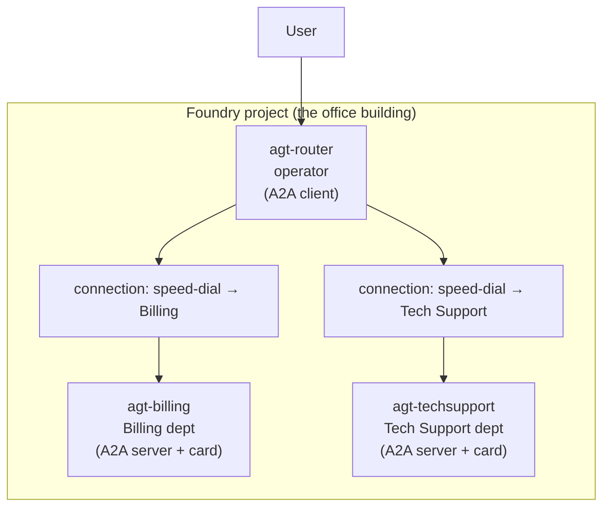

# 01 — How A2A Multi‑Agent Works (understand it first, no commands)

This file makes you **understand** the machine before you build it. No commands
here — just the story, the players, and how a request travels. We stay inside the
**phone switchboard** analogy the whole time.

---

## 1. The story (one request's journey)

> A user types: **"I was charged twice for my invoice."**
>
> 1. The message arrives at **`agt-router`** — the **switchboard operator**.
> 2. The operator reads it and thinks: *"money problem → that's Billing."*
> 3. The operator **dials Billing's extension** (an **A2A call**).
> 4. **`agt-billing`** (the Billing department) does the actual work and answers.
> 5. The operator relays Billing's answer back to the user.
>
> The user thinks they talked to **one** assistant. Really, a receptionist
> quietly transferred them to the right expert.

Keep this exact story in mind — every concept below is just a part of it.

---

## 2. Meet the players (glossary — every term defined once)

| Term | Plain explanation | Switchboard analogy |
|---|---|---|
| **Agent** | An AI worker: a model + instructions + tools | An employee |
| **Prompt agent** | An agent you define with just instructions/tools (no code, Foundry runs it) | A staff member who follows a written job sheet |
| **Hosted agent** | An agent whose logic is your own code in a container | A staff member who brought their own toolkit/program |
| **Router agent** | An agent whose only job is to forward requests | The switchboard operator |
| **Specialist agent** | An agent focused on one domain | A department (Billing, Tech Support) |
| **A2A (Agent‑to‑Agent)** | A standard way for one agent to call another | The internal phone system |
| **Agent card** | A public description: name, what it does, its "skills" | The directory entry for a department |
| **Skill** | One specific capability listed on the card | A service the department offers ("refund lookup") |
| **A2A endpoint** | The URL other agents dial to reach an agent | The department's phone extension |
| **Incoming A2A (enable)** | Switching an agent ON so others can call it | Publishing the extension so the operator can dial it |
| **A2A connection** | Saved endpoint + auth the router uses to reach a specialist | A speed‑dial entry on the operator's phone |
| **A2A tool** | The thing attached to the router that actually makes the call | The operator's "transfer call" button |
| **Entra ID / token** | Microsoft's identity system / your login proof | Your employee ID badge |
| **Foundry Agent Consumer role** | Permission to *call* agents in a project | Clearance to dial internal extensions |

> 🧠 **Key mental model:** an agent card + enabled A2A endpoint turns a
> "department" into one the **operator can dial**. A connection is the operator's
> **saved speed‑dial** for that department.

---

## 3. The two sides of A2A (this trips everyone up)

A2A always has **two ends**. Mixing them up is the #1 source of confusion.

| Side | Who plays it here | What it means | Analogy |
|---|---|---|---|
| **A2A server (incoming)** | `agt-billing`, `agt-techsupport` | "I can be **called** by other agents" | A department that **publishes its extension** |
| **A2A client (outgoing)** | `agt-router` | "I **call** other agents" | The operator who **dials** extensions |

So the build has two halves:
1. **Turn the specialists into servers** (publish their extensions) — file 2, Part A.
2. **Make the router a client** (save speed‑dials + add a transfer button) — file 2, Part B.

---

## 4. Architecture diagram



- Each specialist has an **agent card** and an **enabled A2A endpoint** (it's a *server*).
- The router has **two connections** (speed‑dials) and a **transfer button** (the A2A tool) → it's the *client*.

---

## 5. The addresses & values (real, illustrative — map to yours)

These are the **example** names used in every file. Replace with your own using
the table in file 2.

| Thing | Example value |
|---|---|
| Foundry resource (account) | `foundryfull` |
| Project | `proj-demo-sea-001` |
| Project endpoint | `https://foundryfull.services.ai.azure.com/api/projects/proj-demo-sea-001` |
| Model deployment | `gpt-5.4-mini` |
| Billing agent | `agt-billing` |
| Tech Support agent | `agt-techsupport` |
| Router agent | `agt-router` |

**What an A2A endpoint URL looks like** (Billing's "extension"):

```
https://foundryfull.services.ai.azure.com/api/projects/proj-demo-sea-001/agents/agt-billing/endpoint/protocols/a2a
```

The agent card (directory entry) is fetched at:

```
.../agents/agt-billing/endpoint/protocols/a2a/agentCard/v1.0
```

---

## 6. End‑to‑end flow (sequence)

```mermaid
sequenceDiagram
    participant U as User
    participant R as agt-router (operator)
    participant B as agt-billing (Billing)
    U->>R: "I was charged twice"
    R->>R: Read message → decide: Billing
    R->>B: A2A call (dial Billing's extension, with my badge)
    B->>B: Look up the charge
    B-->>R: "Duplicate charge found; refund issued"
    R-->>U: Relays Billing's answer
```

In plain English:
1. User message lands on the **router**.
2. Router's model reads it and **chooses one specialist** (based on the specialist's *description*).
3. Router **dials** that specialist over A2A, proving identity with an **Entra token** (badge).
4. Specialist does the work and replies.
5. Router hands the reply back to the user.

---

## 7. Deep dive: how does the router "decide"?

There is **no `if/else` code**. The router's **model** reads the user message and
compares it to each specialist's **description** on the agent card, then picks the
best match — exactly like a receptionist reading a nameplate board.

> 💡 **This is why descriptions matter more than anything.** "Billing — invoices,
> payments, refunds" vs "Tech Support — logins, errors, passwords" is what makes
> routing correct. Vague descriptions = wrong transfers.

---

## 8. Rules & limits you must respect (verified from docs)

| Rule | Why it matters |
|---|---|
| **A2A can't be fully enabled in the portal yet** | You must run one REST/SDK call per specialist |
| **Entra auth only — no API keys** | The router calls specialists using a **badge (token)**, not a key |
| **Caller needs `Foundry Agent Consumer` role** | Without the badge clearance, calls are rejected |
| **Text only, no streaming** | A2A here passes plain text answers |
| **Prompt agents work out of the box; Hosted agents need the responses protocol** | Your specialist must "speak" the responses protocol to be callable |
| **Preview feature** | Fine for pilots; validate before production |

---

## 9. Root causes & fixes (when it fails — same analogy)

| Symptom | What went wrong (plain English) | Fix | Prevented in file 2 → step |
|---|---|---|---|
| `403 Forbidden` when router calls specialist | The operator has no badge clearance to dial internal extensions | Grant **Foundry Agent Consumer** on the project to the router's identity | Part B → Step 5 |
| Router never transfers / answers itself | Nameplates too vague — operator can't tell departments apart | Sharpen each specialist's **description**/skills | Part A → Step 2 |
| "Agent card not found" / 404 | You dialed the wrong extension, or A2A wasn't turned on | Re‑run the enable PATCH; verify the card URL | Part A → Step 3 + Verify |
| Works in portal test, fails when called | Auth mismatch — key used instead of badge | Use **Entra**/agentic identity, not key‑based | Part B → Step 3 |

> 🧠 **Mental model recap (6 sentences):** You have two expert departments and one
> receptionist. First you *publish each department's extension* (enable A2A +
> write an agent card). Then you give the receptionist *speed‑dials* to those
> extensions (A2A connections) and a *transfer button* (the A2A tool). The
> receptionist's brain (the model) reads each caller's request and picks the
> right department by its nameplate (description). Everyone proves who they are
> with a badge (Entra token). The user just talks to the receptionist and always
> reaches the right expert.

Next: **[02-setup-step-by-step.md](02-setup-step-by-step.md)** to build it.
