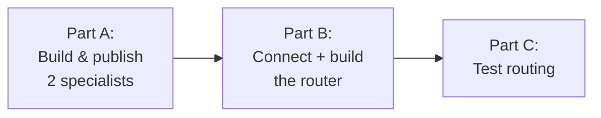

# 02 — Build It, Step by Step (portal menus + scripts)

This is the **do‑it** guide. We build the **exact** system from file 1: two
specialist "departments" (`agt-billing`, `agt-techsupport`) and one "receptionist"
router (`agt-router`) that transfers each request over **A2A**.

Every step follows the same shape:

> **① What & why · ② Where (menu) · ③ What to fill in · ④ What it creates · ⑤ Script · ⑥ Verify**
> — plus a 📞 **Analogy** and a 🛡️ **Risk this prevents** callout.

> 🧠 **Reminder:** A2A can't be *fully* turned on in the portal yet. We use the
> portal for the easy parts and **one short script** to enable A2A. **Entra
> (badge) auth only — no API keys.**

> ✅ **This guide reflects a real, working build.** Every error in the
> [Troubleshooting](#-troubleshooting-the-real-error-chain) section was actually
> hit and fixed while standing this up — and they appear in the order you're
> likely to see them.

---

## 🧰 Prerequisites (do these first)

| Need | How |
|---|---|
| **Azure CLI signed in** | `az login` (this is your "badge") |
| **Build permissions** | **Foundry User** role on the project (create/test agents) |
| **Call permissions** | **Foundry Agent Consumer** for the *calling* identity (Step B3) |
| **Python** | `pip install "azure-ai-projects>=2.3.0" azure-identity` (use a `.venv`) |

> ⚠️ **First gotcha — `variables.ps1` not found.** Every script runs
> `. "$PSScriptRoot\variables.ps1"`. If you see:
>
> ```text
> . : The term 'C:\...\scripts\variables.ps1' is not recognized ...
> ```
>
> …you simply haven't created it yet. **Fix (once):**
>
> ```powershell
> cd .\a2afoundry\scripts
> Copy-Item .\variables.example.ps1 .\variables.ps1
> # then edit variables.ps1 with YOUR values (next section)
> ```

---

## 🔧 Map to YOUR real values (fill this in once)

The examples below are the **real values from a working build** so you can see the
exact shape. Replace them with yours in `variables.ps1`.

| Placeholder | Example (real build) | Your value |
|---|---|---|
| `ACCOUNT` (Foundry resource) | `<your-account>` | ______ |
| `PROJECT` | `<your-account>-project` | ______ |
| `PROJECT_ENDPOINT` | `https://<your-account>.services.ai.azure.com/api/projects/<your-account>-project` | ______ |
| `SUBSCRIPTION_ID` | `5a7c13bd-…` | ______ |
| `RESOURCE_GROUP` | `rg_a2a_foundry` | ______ |
| `MODEL` | `gpt-5.4-mini` | ______ |
| Billing agent | `agt-billing` | ______ |
| Tech Support agent | `agt-techsupport` | ______ |
| Router agent | `agt-router` | ______ |
| **A2A audience** (Entra) | `https://ai.azure.com` | *(fixed value)* |

> 💡 **Portal‑created projects are named `<account>-project`.** If you created the
> project in the portal, its name is likely `<your-account>-project`, **not**
> a custom name. Use that **exact** name everywhere — a wrong or placeholder
> project name is the #1 cause of the `404 agent card` error (see Troubleshooting).

---

## 🧭 Build order (why this order)

You can't save a **speed‑dial** to an extension that isn't **published** yet, and
you can't add a **transfer button** before the speed‑dials exist. So:



1. **Part A** — create the 2 specialists and **enable A2A** (publish extensions).
2. **Part B** — create A2A **connections** (speed‑dials), grant the **badge**, and build the **router**.
3. **Part C** — test that routing works, and read the **Traces**.

---

# PART A — Build & publish the two specialists

## Step A1 — Create the two specialist agents (portal)

**① What & why:** Create the two "departments" that actually answer questions.
**② Where:** Foundry portal → left rail **Agents** → **+ New agent**.
**③ What to fill in (do this twice):**

| Field | Billing agent | Tech Support agent |
|---|---|---|
| Name | `agt-billing` | `agt-techsupport` |
| Model | `gpt-5.4-mini` | `gpt-5.4-mini` |
| Instructions | "You are the Billing department. Answer questions about invoices, payments, refunds, and duplicate charges. Be concise." | "You are Tech Support. Help with logins, password resets, and error messages. Be concise." |

**④ What it creates:** two **prompt agents**. Prompt agents speak the "responses
protocol" **by default**, which is exactly what A2A needs — no extra work.
**⑤ Script:** (optional) you can also create them in code, but the portal is
simplest for beginners. Click **Save** on each.
**⑥ Verify:** open each agent → **Chat** → ask "test" → it replies.

> 📞 **Analogy:** you just hired two departments and gave each a job sheet.
> 🛡️ **Risk this prevents:** vague jobs → wrong answers later. Clear, single‑domain
> instructions keep each department in its lane (file 1 → §9, "answers itself").

---

## Step A2 — Write each specialist's agent card (the nameplate)

**① What & why:** The **agent card** is the public "directory entry" the router
reads to decide who to call. This is the **most important** step for good routing.
**② Where:** on each specialist, open the **Details** tab → **Create an agent card
to set up A2A** (Preview). *(If your tenant doesn't show it, skip — the script in
A3 writes the card too.)*
**③ What to fill in:**

For **`agt-billing`**:
- **Name:** `agt-billing`
- **Description:** `Billing department. Handles invoices, payments, refunds, and duplicate or incorrect charges.`
- **Skill → name:** `Refund lookup` · **Skill description:** `Find and explain charges, duplicates, and refunds.` · **Example prompts:** `I was charged twice`, `Where is my refund?`

For **`agt-techsupport`**:
- **Name:** `agt-techsupport`
- **Description:** `Tech Support. Handles logins, password resets, account lockouts, and error messages.`
- **Skill → name:** `Login help` · **Skill description:** `Resolve password resets and login errors.` · **Example prompts:** `I can't log in`, `Password expired`

**④ What it creates:** a **card** describing each agent's capabilities. The router
uses the **descriptions** to route correctly.
**⑤ Script:** the card is *also* set by the enable script in Step A3 (recommended
path), so you don't have to hand‑type it in the portal.
**⑥ Verify:** after A3, fetch the card URL (shown in A3 verify) and confirm the
description matches.

> 📞 **Analogy:** you wrote each department's nameplate so the operator can tell
> them apart.
> 🛡️ **Risk this prevents:** wrong transfers. Distinct descriptions
> (money vs logins) = correct routing (file 1 → §9, "never transfers").

---

## Step A3 — Turn ON incoming A2A for both specialists (script — required)

**① What & why:** This "publishes the extension" — it enables the A2A protocol
**and** stores the agent card. **This step is not clickable in the portal yet**,
so we use a tiny REST call.
**② Where:** your terminal (PowerShell), signed in with `az login`.
**③ What to fill in:** nothing — it reads `variables.ps1`.
**④ What it creates:** each specialist becomes an **A2A server** with a dialable
endpoint and a public card.
**⑤ Script:** run it:

```powershell
az login                      # sign in once (get your badge)
.\scripts\1-enable-a2a.ps1    # publishes A2A on both specialists
```

**⑥ Verify:** the script prints each agent card back. You should see your
descriptions. You can also fetch it manually:

```powershell
. .\scripts\variables.ps1
$TOKEN = az account get-access-token --resource https://ai.azure.com --query accessToken -o tsv
Invoke-RestMethod -Method Get `
  -Uri "$PROJECT_ENDPOINT/agents/agt-billing/endpoint/protocols/a2a/agentCard/v1.0" `
  -Headers @{ Authorization = "Bearer $TOKEN" }
```

> 📞 **Analogy:** the two departments' extensions are now listed in the company
> directory — the operator can dial them.
> 🛡️ **Risk this prevents:** "agent card not found / 404" when the router tries to
> call (file 1 → §9). No publish = no extension to dial.

---

# PART B — Connect + build the router

## Step B1 — Create one A2A connection per specialist

**① What & why:** A **connection** is the operator's **speed‑dial**: it stores a
specialist's A2A endpoint **plus how to authenticate** (Entra badge). You make two
— one per department. *This is where every real error happened, so use the exact
settings below.*

**② Where:** Foundry portal → open **`agt-router`** → **Tools** → **Add →
Agent2Agent (A2A)**.

> 🔀 **Order note:** if you're clicking through the portal, create the router
> agent **first** (Step B2 shows the name, model, and instructions), then add
> these two A2A tools to it. The `3-create-router.py` script does both in one
> shot — router **and** tools.

**③ What to fill in — use these exact settings** (do it twice):

| Dialog field | Billing | Tech Support | Why it matters |
|---|---|---|---|
| **Name** | `conn-billing` | `conn-techsupport` | Speed‑dial name (the router's tools must reference these) |
| **A2A Agent Endpoint** | `…/api/projects/`**`<your-project>`**`/agents/agt-billing/endpoint/protocols/a2a` | same, with `agt-techsupport` | ⚠️ Use your **real project name** — never the literal word `PROJECT` |
| **Agent Card Path** | **(leave blank)** | **(leave blank)** | Foundry auto‑resolves the card at `/agentCard/v1.0`; a custom path → **404** |
| **Authentication** | **Microsoft Entra ID – project managed identity** | same | Reliable for Foundry→Foundry; *agent identity* can **400** in a fresh project |
| **Audience** | `https://ai.azure.com` | `https://ai.azure.com` | Required, or you get **400 “Missing … 'audience'”** |
| **Credential** | *(empty)* | *(empty)* | Entra = no key |

Full endpoint example (real build):
`https://<your-account>.services.ai.azure.com/api/projects/<your-account>-project/agents/agt-billing/endpoint/protocols/a2a`

**④ What it creates:** two project connections the router can dial, authenticated
by the **project's managed identity**. Each counts toward the project's
**120‑connection** limit (reuse, don't duplicate).

**⑤ Script alternative:** `2-create-connections.ps1` can create both. Make sure it
sets **`authType=ProjectManagedIdentity`**, **`audience=https://ai.azure.com`**,
and the **real project name** in the `target` (not the literal `PROJECT`).

**⑥ Verify:** the connections appear under **Operate → Admin → Connected
resources**. Open each and confirm its **target** URL contains your **real project
name** — not `PROJECT`.

> 📞 **Analogy:** two badge‑protected speed‑dials on the operator's phone, each
> pointing at the *correct* published extension.
> 🛡️ **Risk this prevents:** the entire error chain below — wrong project name
> (404), missing audience (400), key auth (403), or a custom card path (404).

> ⚠️ **Why not “Agent identity”?** The portal also offers **Microsoft Entra ID –
> agent identity** (agentic identity). In a **fresh, unpublished** project that
> path often fails with `Failed to fetch agentic identity access token: 400`.
> **Project managed identity** is the reliable choice for Foundry‑to‑Foundry A2A
> in the same project. (If you must use agent identity, **publish** the specialists
> first so each gets its own identity.)

---

## Step B2 — Create the router agent with the A2A tool (Python)

**① What & why:** Build the **receptionist** and give it the **transfer button**
(the A2A tool) wired to both speed‑dials.
**② Where:** terminal (Python). Install once:
`pip install "azure-ai-projects>=2.3.0" azure-identity`.
**③ What to fill in:** edit the names at the top of the script if you changed them.
**④ What it creates:** `agt-router`, a prompt agent whose tools are the two A2A
connections, with routing instructions.
**⑤ Script:**

```powershell
python .\scripts\3-create-router.py
```

**⑥ Verify:** the script prints the router's id/version and runs two test
messages (see Part C).

> 📞 **Analogy:** you hired the operator and taught them to transfer calls to the
> two saved speed‑dials.
> 🛡️ **Risk this prevents:** a router with no way to reach specialists.

---

## Step B3 — Grant the badge (role assignment)

**① What & why:** Even with speed‑dials, the caller needs **clearance** to dial
internal extensions. Grant **Foundry Agent Consumer** to the **identity that makes
the call** — for **project managed identity** auth (Step B1), that's the
**project's managed identity**.
**② Where:** Azure portal → your **Foundry resource** (`<your-account>`) →
**Access control (IAM)** → **+ Add → Add role assignment**.
**③ What to fill in:**
- **Role:** **Foundry Agent Consumer** *(if not visible yet, pick **Azure AI User** — same role ID, mid‑rename).*
- **Assign access to:** **Managed identity**
- **Members:** the **project** managed identity (named like `<your-account>-project`). If it isn't listed, pick the account (`<your-account>`).

**④ What it creates:** an RBAC assignment letting the project's identity call the
specialists' A2A endpoints.
**⑤ Script (CLI equivalent):**

```powershell
. .\scripts\variables.ps1
$scope = "/subscriptions/$SUBSCRIPTION_ID/resourceGroups/$RESOURCE_GROUP/providers/Microsoft.CognitiveServices/accounts/$ACCOUNT/projects/$PROJECT"
# Foundry Agent Consumer role ID (stable across the rename):
az role assignment create `
  --assignee-object-id <project-managed-identity-objectId> `
  --assignee-principal-type ServicePrincipal `
  --role "eed3b665-ab3a-47b6-8f48-c9382fb1dad6" `
  --scope $scope
```

**⑥ Verify:** re‑run a router test (Part C). No `403` = clearance works.

> ⏱️ **Propagation:** role changes can take **up to ~10 minutes**. If the first
> test 403s, wait and retry — no config change needed.
> 📞 **Analogy:** you gave the operator a badge that opens the internal lines.
> 🛡️ **Risk this prevents:** `403 Forbidden` when the router calls a specialist.

---

# PART C — Test the routing

## Step C1 — Prove it routes correctly

**① What & why:** Confirm the receptionist forwards each request to the right
department.
**② Where:** the router agent → **Chat** (portal), or the test built into
`3-create-router.py`.
**③ What to try:**

| You type | Should route to | Because |
|---|---|---|
| `I was charged twice for my invoice` | `agt-billing` | money/invoice words match Billing's card |
| `I can't log in, password expired` | `agt-techsupport` | login/password words match Tech Support's card |

**④ What it creates:** nothing — it's a test.
**⑤ Script:** already run by `3-create-router.py`; or in the portal Chat tab.
**⑥ Verify:** open the router's **Traces** tab and confirm it shows an **A2A tool
call** to the expected specialist.

> 📞 **Analogy:** you called the switchboard twice and confirmed you reached
> Billing once and Tech Support once.
> 🛡️ **Risk this prevents:** silent mis‑routing. Traces prove *who* answered.

---

## 🧩 Troubleshooting: the real error chain

Standing this up produces errors in a **predictable order** — each one is the
*next* layer of the connection starting to work. Here's the exact sequence we hit,
what each really means, and the fix.

| # | Error you see | What it really means | Fix |
|---|---|---|---|
| 1 | `The term '…\variables.ps1' is not recognized` | You never created `variables.ps1` | `Copy-Item variables.example.ps1 variables.ps1`, then edit it (Prerequisites) |
| 2 | `Failed to fetch agentic identity access token. Status: 400` | Connection uses **Agent identity**, which can't mint a token in a fresh/unpublished project | Switch the connection to **Project managed identity** (Step **B1**) |
| 3 | `Failed to fetch access token … Missing required query parameter 'audience'` | Entra auth with **no audience** set | Set **Audience = `https://ai.azure.com`** (Step **B1**) |
| 4 | `Failed to fetch agent card: 404 (NotFound)` | Either (a) A2A **not enabled** on the specialist, or (b) the endpoint has the **wrong project name** (literal `PROJECT`) or a **custom card path** | (a) run `1-enable-a2a.ps1`; (b) fix the endpoint to your **real project name** and **blank** the card path (Step **B1**) |
| 5 | `403 Forbidden` on the call | Calling identity lacks the badge | Grant **Foundry Agent Consumer** (Step **B3**); wait ~10 min |
| — | Router answers itself / won't transfer | Agent cards too vague | Sharpen descriptions (Step **A2**) |
| — | Model error on run | `MODEL` wrong/unavailable in region | Fix `MODEL` in `variables.ps1` |

> 🧠 **Mental model:** a connection is like dialing a number — you need the
> **right number** (real project name), a **valid badge** (project MI + role), the
> **badge's audience** (`https://ai.azure.com`), and the **extension must be
> published** (A2A enabled). Miss any one and you get a specific error above.

---

## ✅ You're done when…

In **`agt-router` → Chat**:

- `I was charged twice for invoice #4471.` → reaches **Billing**
- `I can't log in, my password expired.` → reaches **Tech Support**

…and the **Traces** tab shows the transfer, e.g.:

```text
Invoke Agent  agt-router
└─ Execute Tool  remote_a2a  conn-billing.SendMessage
   └─ Invoke Agent  agt-billing
```

That's the full switchboard working. 🎉

Next: **[03-use-cases.md](03-use-cases.md)** for detailed real‑world scenarios.
