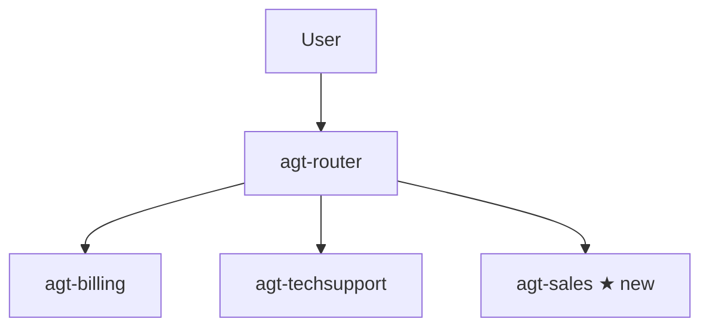

# 03 — Use‑Case Scenarios (in detail)

Real, concrete walk‑throughs of the **same** two‑specialist + router system.
We stay in the **switchboard** analogy and reuse our characters: **`agt-router`**
(operator), **`agt-billing`** (Billing), **`agt-techsupport`** (Tech Support).

---

## Use case 1 — "I was charged twice" (routes to Billing)

**Who:** a customer using your support chat.
**Goal:** get a duplicate charge explained/refunded without knowing which team to ask.

**Step‑by‑step journey:**

```mermaid
sequenceDiagram
    participant U as Customer
    participant R as agt-router (operator)
    participant B as agt-billing (Billing)
    U->>R: "I was charged twice for invoice #4471"
    R->>R: Reads card descriptions → "money" → Billing
    R->>B: A2A call (with Entra badge)
    B->>B: Looks up invoice #4471, finds duplicate
    B-->>R: "Duplicate confirmed; refund of $49 issued"
    R-->>U: Relays Billing's answer
```

**Why it works:** Billing's **agent card** says *"invoices, payments, refunds,
duplicate charges."* The words in the user's message match, so the operator dials
Billing.

**What you'd see in Traces:** one **A2A tool call** from `agt-router` →
`agt-billing`. If you instead saw the router answer directly, the fix is to make
Billing's description more specific (see file 2 → Step A2).

---

## Use case 2 — "I can't log in" (routes to Tech Support)

**Who:** an employee locked out of an app.
**Goal:** reset access fast.

```mermaid
sequenceDiagram
    participant U as Employee
    participant R as agt-router (operator)
    participant T as agt-techsupport (Tech Support)
    U->>R: "I can't log in, it says password expired"
    R->>R: Reads cards → "login/password" → Tech Support
    R->>T: A2A call (with Entra badge)
    T->>T: Explains reset steps
    T-->>R: "Reset your password at aka.ms/reset; expires every 90 days"
    R-->>U: Relays Tech Support's answer
```

**Why it works:** Tech Support's card says *"logins, password resets, error
messages."* Clean separation from Billing's card = no confusion.

---

## Use case 3 — Ambiguous request (router asks a clarifying question)

**Who:** a user who types something vague.

> User: **"I have a problem with my account."**

An account problem could be **Billing** (a charge) or **Tech Support** (a login).
A good router **doesn't guess** — its instructions tell it to ask one short
question first:

> Router: *"Is this about a charge/invoice, or about logging in?"*
> User: *"A charge."* → Router transfers to **Billing**.

**Why it works:** in file 2 the router's instructions include *"If unclear, ask
one short clarifying question."* This is the operator saying *"Billing or Tech
Support?"* before transferring.

> 💡 **Design tip:** always give the router a fallback instruction to clarify.
> Without it, vague requests get sent to the wrong department.

---

## Use case 4 — Adding a THIRD department later (why this design scales)

Tomorrow you want a **Sales** agent (`agt-sales`). With the router pattern you
**don't touch** Billing, Tech Support, or the router's core logic. You just:

1. Create `agt-sales` (Step A1) and write its card (Step A2).
2. Enable A2A on it (Step A3).
3. Add one connection (Step B1) and attach it to the router (Step B2).



> 📞 **Analogy:** you added a new department extension and one new speed‑dial. The
> operator instantly knows how to transfer to it — no retraining of the others.
> ✅ **Takeaway:** this is the payoff of the pattern — growth is additive, not a
> rewrite.

---

## Use case 5 — One department is down (blast radius is contained)

Suppose Billing's underlying data source breaks.

- **With one giant agent:** the whole assistant fails for everyone.
- **With the router pattern:** only **Billing** calls fail. Login questions still
  work perfectly because Tech Support is untouched. The router can even reply
  *"Billing is temporarily unavailable, please try later"* while everything else
  runs.

> 🛡️ **Why this matters:** this is the reliability reason the router pattern
> exists — a failure is **one department**, not the whole company.

---

## When NOT to use this pattern

| Situation | Better choice |
|---|---|
| You need strict step‑by‑step logic, loops, parallel fan‑out | A **Hosted agent** with Microsoft Agent Framework (pro‑code) |
| Just 2–3 tools total, one domain | A **single prompt agent** is simpler |
| You need guaranteed source citations passed through | Test carefully — A2A/router may not always pass citations |

> 🧠 **Rule of thumb:** use the **router + specialists** pattern when you have
> several **distinct domains** and want low‑code routing. Reach for pro‑code only
> when you need orchestration the model can't express by reading nameplates.
