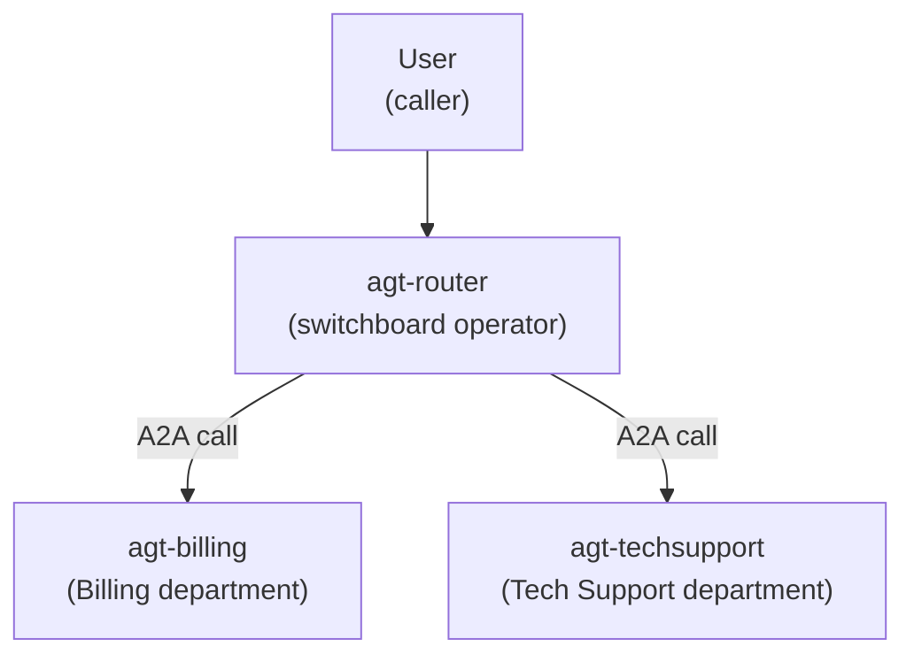

# A2A on Microsoft Foundry — Router + 2 Specialist Agents (Newbie Guide)

This folder teaches you — from **zero knowledge** — how to build a **multi‑agent
system** on the *new* Microsoft Foundry using the **Agent‑to‑Agent (A2A)**
feature: **one router agent** that listens to the user and forwards each request
to **one of two specialist agents**.

> 🧠 **The whole idea in one sentence:** instead of cramming everything into one
> giant agent, you build small expert agents and put a "receptionist" in front
> that decides who should answer.

---

## �️ What's in this repository

| Part | What it is | Start here |
|---|---|---|
| **Concept guide** (this folder) | Learn A2A from zero and build **Scenario 1** (all agents in Foundry) by hand | [01-how-it-works.md](01-how-it-works.md) → [02-setup-step-by-step.md](02-setup-step-by-step.md) → [03-use-cases.md](03-use-cases.md) |
| **Runnable demo** ([`modular/`](modular/)) | The **same idea shown 4 ways** (router in Foundry vs your code, specialists in Foundry vs your code) with a FastAPI web app, a hand-rolled A2A code agent, and Azure deployment | [modular/README.md](modular/README.md) |

> 💡 **New here?** Read this guide first to understand A2A, then open
> [`modular/`](modular/) to run all four routing scenarios end-to-end.
>
> 🔒 **Configuration is masked.** All docs use placeholders like `<your-account>`,
> `<your-project>`, and `<subscription-id>`. Copy the `*.example` files to your own
> `variables.ps1` / `.env` and fill in your real values (these are git-ignored).

---

## �📞 The one analogy we use everywhere: a company phone switchboard

Everything in this guide maps to a **company phone system**. Keep this picture in
your head the entire time.

| Real Foundry thing | Switchboard analogy | Plain meaning |
|---|---|---|
| **Router agent** | The **switchboard operator / receptionist** | Listens to the caller, decides which department, and transfers the call |
| **Specialist agent** | A **department** (Billing, Tech Support) | The expert who actually answers |
| **Agent card** | The **directory entry** for a department ("Billing — handles invoices, ext. 101") | A public description of what an agent can do |
| **Enable incoming A2A** | **Publishing the extension** in the company directory | Turning an agent into something others can *call* |
| **A2A endpoint (URL)** | The department's **phone extension number** | The address other agents dial |
| **A2A connection** | A **speed‑dial entry** saved on the operator's phone | Stored info the router uses to reach a specialist |
| **Entra auth / roles** | Your **employee ID badge** | You must be a valid employee to make internal calls |
| **A message / task** | The **caller's request** | What the user asked for |

We also use the **same** two specialists throughout every file and diagram:

- **Billing agent** (`agt-billing`) — invoices, payments, refunds.
- **Tech Support agent** (`agt-techsupport`) — password resets, error messages.
- **Router agent** (`agt-router`) — the receptionist that forwards to the right one.

---

## 🎬 The running scenario (one story, reused everywhere)

> A user opens your company assistant and types:
> **"I was charged twice for my invoice last month."**
>
> The **router** (receptionist) reads it, realizes it's about money, and
> **transfers the call to the Billing department**. Billing looks it up and
> answers. The user never had to know which "department" to pick — they just
> talked to one assistant.
>
> Next the user types **"I can't log in, it says password expired."** The same
> router now transfers to **Tech Support** instead.

That is the entire system. Two experts, one receptionist, automatic routing.

---

## 🧩 Why do this at all? (why before how)

| Problem with ONE big agent | How the router + specialists fixes it |
|---|---|
| One agent with 30+ tools picks the wrong tool and gets slow | Each specialist has a **few** focused tools → accurate & fast |
| A single broken tool takes the **whole** agent down | A broken specialist only affects **its** department |
| Hard to know who owns what | Each department is owned & updated independently |
| Hits platform limits (128 tools/agent, 120 connections/project) | Work is spread across several small agents |

> ✅ **Takeaway:** the router pattern is how you scale from a toy agent to a real
> system without one giant fragile agent.

---

## 🗺️ What you'll build (the finished picture)

- The user only ever talks to **`agt-router`**.
- `agt-router` **dials** one specialist per request using **A2A**.

---

## ⚠️ The single most important reality check (read this first)

Based on the **official Microsoft docs (verified)**:

> **Enabling incoming A2A is NOT fully clickable in the Foundry portal yet.**
> The portal lets you *start* the agent card, but **turning on the A2A protocol
> must be done with the REST API or Python SDK.** Also, **only Microsoft Entra
> (badge) authentication works — API keys are NOT supported** for A2A.

So this is **"low‑code with a small required script step."** Don't worry — the
scripts are provided and explained line‑by‑line.

---

## 📚 Read the files in this order

| # | File | What it gives you | Time |
|---|---|---|---|
| 1 | [01-how-it-works.md](01-how-it-works.md) | **Understand** the pieces & the flow — no commands | 10 min |
| 2 | [02-setup-step-by-step.md](02-setup-step-by-step.md) | **Do it** — portal menus + scripts, step by step | 30–45 min |
| 3 | [03-use-cases.md](03-use-cases.md) | Detailed real‑world use‑case walkthroughs | 10 min |
| — | [scripts/](scripts/) | Ready‑to‑run scripts (fill in your names) | — |

> 💡 **Tip:** even if you plan to run the scripts, read file 1 first. Two minutes
> of "why" saves an hour of confused clicking.

---

## ✅ Prerequisites (what you need before starting)

- An **Azure subscription** and a **Microsoft Foundry project** (new Foundry).
- A **deployed model** in the project (e.g., `gpt-5.4-mini`).
- The **Foundry User** role (to enable A2A) and **Foundry Agent Consumer** role
  (so the router is allowed to call the specialists) on the project.
- **Azure CLI** installed and signed in (`az login`).
- For the router script: **Python 3.10+** with
  `pip install "azure-ai-projects>=2.3.0" azure-identity`.

Full details and a "map to your real values" table are in
[02-setup-step-by-step.md](02-setup-step-by-step.md).
