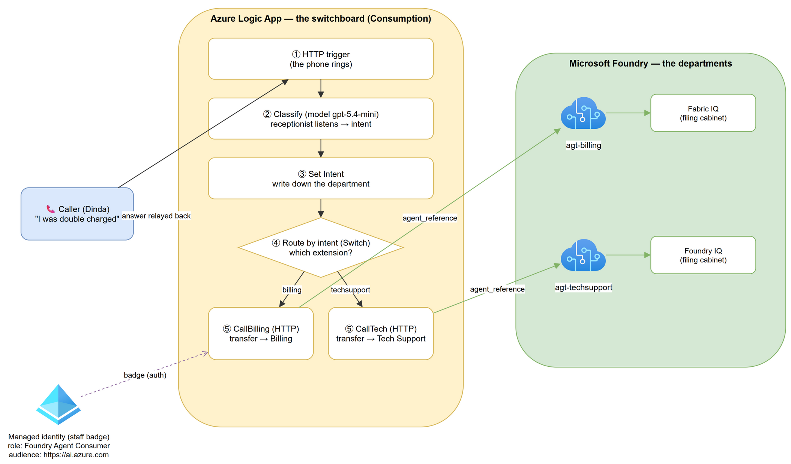
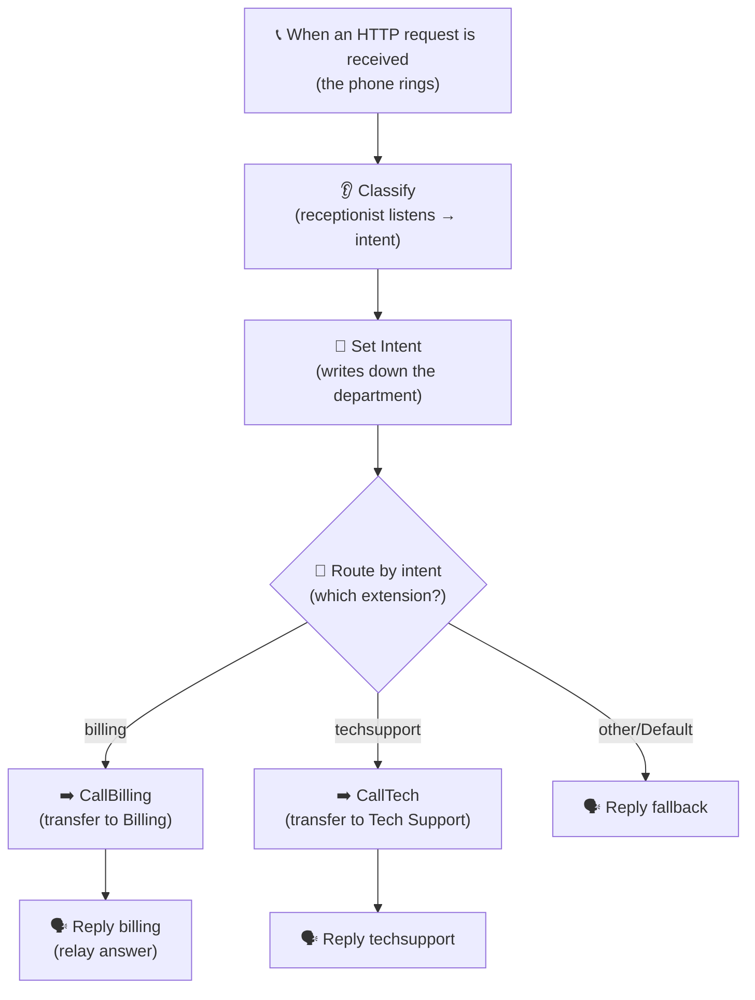

# Build Guide — Route customer messages to Foundry agents with Azure Logic Apps (low‑code)

> A complete, beginner‑friendly walkthrough. You will build a **Logic App** that
> reads an incoming message, decides what it's about, and hands it to the right
> **Microsoft Foundry agent** (which uses Fabric IQ / Foundry IQ). No coding —
> just the portal and a few HTTP steps.

---

## 0. The one story we'll follow the whole way

> **Dinda** sends the message *“I was double charged on my last invoice.”*
> We want that message to reach the **Billing specialist** automatically, get a
> real answer, and come back to Dinda — without a human operator in the middle.

We reuse this exact story (Dinda + the double‑charge message) in every step and diagram.

### The analogy we use everywhere: a **company phone switchboard** 🏢☎️

Keep this single picture in your head for the whole guide:

| Real thing (technical) | Switchboard analogy |
|---|---|
| **Logic App** | The **front‑desk switchboard** that answers every call |
| **HTTP trigger** (`When an HTTP request is received`) | The **phone ringing** — a call arrives |
| **Classifier model call** (`Classify`) | The **receptionist listening** to figure out what you need |
| **`intent`** (billing / techsupport / other) | The **department name** the receptionist wrote down |
| **Switch** (`Route by intent`) | The receptionist **choosing which extension to dial** |
| **HTTP call to the agent** (`CallBilling` / `CallTech`) | **Transferring the call** to that department |
| **Foundry agent** (`agt-billing`, `agt-techsupport`) | The **department specialist** who actually answers |
| **Fabric IQ / Foundry IQ** | The specialist's **filing cabinets** (their knowledge) |
| **Managed identity** | The Logic App's **staff ID badge** |
| **Role `Foundry Agent Consumer`** | The **badge clearance** that lets it into the building |
| **Response** action | **Relaying the answer** back to the caller |

We also use the same family for outcomes:

| Outcome | Switchboard picture |
|---|---|
| ✅ Success (HTTP 200) | The specialist picked up and answered |
| ❌ 401 / 403 | Security turned the badge away at the door |
| ❌ 404 | The receptionist dialed an extension that doesn't exist |
| ❌ 400 (bad body) | The receptionist spoke the wrong language on the transfer |
| ❌ NoResponse | Nobody ever picked up, so the caller heard silence |

---

## 1. What you'll build (the map)



> 📝 *Source: [`diagrams/how-it-works.drawio`](diagrams/how-it-works.drawio) (draw.io, Azure icons). Re-render with the `azure-diagrams-drawio` skill's `render-diagrams.ps1`.*

The same flow in a quick sketch:



> 🧠 **Mental model:** The Logic App is a smart switchboard. It never answers the
> question itself — it just listens, decides the department, transfers the call
> to a Foundry specialist, and relays the specialist's answer back.

---

## 2. Prerequisites (what you need before you start)

| You need | Why | Where |
|---|---|---|
| An **Azure subscription** | To create the Logic App | portal.azure.com |
| A **Microsoft Foundry project** with agents | These are the specialists we transfer to | Foundry portal |
| Your **agents already built** (e.g. `agt-billing`, `agt-techsupport`) | They hold the Fabric IQ / Foundry IQ knowledge | Foundry → Agents |
| A **model deployment** (e.g. `gpt-5.4-mini`) | Powers the receptionist's "listening" (classification) | Foundry → Deployments |
| Permission to **assign roles** on the project | So the Logic App's badge gets clearance | Foundry project → Access control (IAM) |

> ⚠️ **Why Consumption, not Standard:** We use the **Consumption** plan because it
> needs **no storage account**. Standard requires storage, and if your
> organization's policy **disables storage shared‑key access**, Standard
> deployment fails. Consumption sidesteps that entirely. (You do **not** need the
> Standard‑only “Agent node” — that only borrows a *model*, it can't run your
> existing agents with their Fabric IQ / Foundry IQ tools. We call the agents
> directly over HTTP instead.)

---

## 3. Map these illustrative values to YOUR real values

The steps below use **real example names** from this project. Replace them with yours.

| Placeholder in this guide | Example value used here | Your value |
|---|---|---|
| `<ACCOUNT>` (Foundry account) | `<your-account>` | ______ |
| `<PROJECT>` (Foundry project) | `<your-account>-project` | ______ |
| `<MODEL>` (classifier deployment) | `gpt-5.4-mini` | ______ |
| Billing agent name | `agt-billing` | ______ |
| Tech support agent name | `agt-techsupport` | ______ |
| Logic App name | `agentfoundryflow` | ______ |
| Region | `Southeast Asia` | ______ |

Your **Foundry endpoint** (used by every HTTP step) is:

```
https://<ACCOUNT>.services.ai.azure.com/api/projects/<PROJECT>/openai/v1/responses
```

---

## 4. Build order (and why this order)

You can't dial an extension before the phones are installed. Same here — order matters:

1. **Create the Logic App** → the switchboard must exist first.
2. **Turn on its managed identity** → give the switchboard a staff badge.
3. **Grant the badge clearance in Foundry** → so it's allowed to transfer calls.
4. **Build the workflow** (trigger → classify → route → transfer → reply).
5. **Publish, then test** → only a published switchboard can answer calls.

---

## 5. Step‑by‑step build

Each step follows the same shape: **① what & why · ② where (menu) · ③ what to fill · ④ what it creates · ⑤ CLI · ⑥ verify** — plus an analogy and the risk it prevents.

---

### Step 1 — Create the Consumption Logic App

**① What & why:** Create the switchboard itself. Without it, there's nothing to answer calls.

**② Where (menu):**
`Azure portal → search "Logic apps" → Logic apps → + Add → Consumption (Multi‑tenant) → Select`

**③ What to fill (Basics tab):**
| Field | Value |
|---|---|
| Subscription | *your subscription* |
| Resource group | e.g. `demo` |
| Logic App name | `agentfoundryflow` |
| Region | `Southeast Asia` |
| Enable log analytics | `No` (optional) |

Then **Review + create → Create → Go to resource**.

**④ This creates:** a Logic App resource, **used by** everything else in this guide.

**⑤ CLI equivalent:**
```powershell
az group create -n demo -l southeastasia
# Consumption logic app is created from a workflow definition file (see Appendix A):
az logic workflow create `
  --resource-group demo `
  --name agentfoundryflow `
  --location southeastasia `
  --definition "@workflow.json"
```

**⑥ Verify:** The resource opens and the left menu shows **Development Tools → Logic app designer**.

> 🏢 **Analogy:** You installed the front desk. The phones aren't wired yet.
> 🛡️ **Risk this prevents:** Choosing **Standard** here would force a storage
> account and hit the shared‑key policy block. Consumption avoids it.

---

### Step 2 — Turn on the managed identity (the staff badge)

**① What & why:** The Logic App needs an identity to prove who it is when it calls
Foundry — so we don't store passwords or keys.

**② Where (menu):**
`Logic App → Settings → Identity → System assigned → Status = On → Save → Yes`

**③ What to fill:** nothing — just toggle **On**. Copy the **Object (principal) ID** shown.

**④ This creates:** a **system‑assigned managed identity** (the badge), **used by**
every HTTP step's authentication and by the Foundry role assignment in Step 3.

**⑤ CLI equivalent:**
```powershell
az logic workflow identity assign `
  --resource-group demo `
  --name agentfoundryflow
```

**⑥ Verify:** The Identity page shows a green **Object (principal) ID**.

> 🏢 **Analogy:** The switchboard now has a staff ID badge — but no clearance yet.
> 🛡️ **Risk this prevents:** Without an identity, agent calls fail with **401/403**
> (security turns it away at the door).

---

### Step 3 — Give the badge clearance in Foundry

**① What & why:** The badge must be allowed to invoke agents in your project.

**② Where (menu):**
`Foundry portal → your project → Access control (IAM) → + Add → Add role assignment`

**③ What to fill:**
| Field | Value |
|---|---|
| Role | `Foundry Agent Consumer` |
| Assign access to | **Managed identity** |
| Members | select `agentfoundryflow` |

Then **Review + assign**. Wait ~10 minutes for it to take effect.

**④ This creates:** a role assignment, **used by** Foundry to allow the Logic App's
badge to call `agt-billing` / `agt-techsupport`.

**⑤ CLI equivalent:**
```powershell
# Get the Logic App identity's principal ID
$pid = az logic workflow show -g demo -n agentfoundryflow --query "identity.principalId" -o tsv
# Assign the role at the Foundry project scope (replace <project-resource-id>)
az role assignment create `
  --assignee $pid `
  --role "Foundry Agent Consumer" `
  --scope "<project-resource-id>"
```

**⑥ Verify:** On the project's **IAM → Role assignments**, `agentfoundryflow` appears
with **Foundry Agent Consumer**.

> 🏢 **Analogy:** Security programmed the badge to open the building's doors.
> 🛡️ **Risk this prevents:** Skipping this → **403 “no permission on project.”**

---

### Step 4 — Add the trigger (the ringing phone)

**① What & why:** Every workflow starts with a trigger. Ours waits for an inbound
HTTP call carrying the customer's `message`.

**② Where (menu):**
`Logic App → Development Tools → Logic app designer → Add a trigger →` search
**When an HTTP request is received** → select it.

**③ What to fill — Request Body JSON Schema:**
```json
{
  "type": "object",
  "properties": { "message": { "type": "string" } }
}
```

**④ This creates:** a callable URL (generated on Save/Publish), **used by** callers
(Postman, PowerShell, your app) to start the workflow.

**⑤ CLI equivalent:** part of the workflow definition — see **Appendix A**.

**⑥ Verify:** After you **Save**, selecting the trigger shows an **HTTP URL** value.

> 🏢 **Analogy:** You wired the phone line — now the switchboard can receive calls.
> 🛡️ **Risk this prevents:** The URL only appears **after Publish**. Forgetting to
> publish → “URL will be generated after save” stays empty.

---

### Step 5 — `Classify`: the receptionist listens (HTTP action)

**① What & why:** Ask a small model to read the message and output **one** word:
`billing`, `techsupport`, or `other`. We force clean JSON so the next step is reliable.

**② Where (menu):**
Under the trigger → **+ → Add an action →** search **HTTP** → select the **HTTP** action.
Rename it to `Classify` (click the title).

**③ What to fill:**
| Field | Value |
|---|---|
| Method | `POST` |
| URI | `https://<ACCOUNT>.services.ai.azure.com/api/projects/<PROJECT>/openai/v1/responses` |
| Headers | `Content-Type` = `application/json` |
| Authentication (open **Add new parameter → Authentication**) | Type = **Managed identity**; Managed identity = **System‑assigned**; **Audience = `https://ai.azure.com`** |

**Body:**
```json
{
  "model": "<MODEL>",
  "input": "Classify the user's intent. Reply with only one of: billing, techsupport, other.\n\nUser message: @{triggerBody()?['message']}",
  "text": {
    "format": {
      "type": "json_schema",
      "name": "intent_result",
      "schema": {
        "type": "object",
        "properties": {
          "intent": { "type": "string", "enum": ["billing", "techsupport", "other"] }
        },
        "required": ["intent"],
        "additionalProperties": false
      }
    }
  }
}
```

**④ This creates:** a classification response, **used by** the next step (`Set Intent`)
to pick the department.

**⑤ CLI equivalent:** see **Appendix A** (`Classify` action).

**⑥ Verify:** After a run, `Classify` is green and its raw output contains
`output[...].content[0].text` = `{"intent":"billing"}` for Dinda's message.

> 🏢 **Analogy:** The receptionist listened to Dinda and wrote “Billing” on a slip.
> 🛡️ **Risk this prevents:** Leaving `<MODEL>` as literal text → **404 NotFound**
> (dialing a model that doesn't exist). Missing **Audience** → **401**.

---

### Step 6 — `Set Intent`: write down the department (variable)

**① What & why:** Pull the single word out of the model's JSON and store it, so the
Switch can branch on it.

**② Where (menu):**
**+ → Add an action →** search **Variables → Initialize variable**. Rename to `Set Intent`.

**③ What to fill:**
| Field | Value |
|---|---|
| Name | `intent` |
| Type | `String` |
| Value | *(use the expression editor — see below)* |

Click **Value → Expression (fx)** and paste the **bare** expression (no `@{ }`):
```
json(last(body('Classify')?['output'])?['content']?[0]?['text'])?['intent']
```
Click **Update**.

**④ This creates:** a variable `intent`, **used by** the Switch.

**⑤ CLI equivalent:** see **Appendix A** (`Set_Intent`).

**⑥ Verify:** In a run, `Set Intent` is green with `expressionResult: billing`.

> 🧠 **Why `last()`?** The model returns an array of output items. Reasoning‑capable
> models add a **reasoning** item first and the **answer** last. `last(...)` always
> grabs the final answer whether or not a reasoning item exists. There is **no**
> top‑level `output_text` field.
> 🏢 **Analogy:** The receptionist read the *last* line of the note (the decision),
> not their own scribbled thinking above it.
> 🛡️ **Risk this prevents:** Using `output[0]` → picks the reasoning item → **null**
> → `InvalidTemplate`. Wrapping the expression in `@{ }` inside the fx editor →
> “expression is invalid.”

---

### Step 7 — `Route by intent`: choose the extension (Switch)

**① What & why:** Branch to the correct department based on `intent`.

**② Where (menu):**
**+ → Add an action →** search **Control → Switch**. Rename to `Route by intent`.

**③ What to fill:**
- **On:** `Expression` → `variables('intent')`
- **Case 1:** value `billing`
- Click **+ (Add)** at the top of the Switch → **Case 2:** value `techsupport`
- (A **Default** branch already exists.)

**④ This creates:** three paths — billing, techsupport, default — **used by** the
transfer steps below.

**⑤ CLI equivalent:** see **Appendix A** (`Route_by_intent`).

**⑥ Verify:** In a run, the branch matching `intent` lights up.

> 🏢 **Analogy:** The receptionist picks the right extension to dial.
> 🛡️ **Risk this prevents:** No Default → an unexpected intent falls through and the
> caller hears silence (**NoResponse**).

---

### Step 8 — `CallBilling` / `CallTech`: transfer the call (HTTP actions)

**① What & why:** Actually invoke the Foundry agent. This is the transfer — the
specialist (with Fabric IQ / Foundry IQ) does the real work **inside Foundry**.

**② Where (menu):** Inside the **billing** case → **Add an action → HTTP**. Rename `CallBilling`.
Repeat inside the **techsupport** case → rename `CallTech`.

**③ What to fill (CallBilling):**
| Field | Value |
|---|---|
| Method | `POST` |
| URI | `https://<ACCOUNT>.services.ai.azure.com/api/projects/<PROJECT>/openai/v1/responses` |
| Headers | `Content-Type` = `application/json` |
| Authentication | **Managed identity** / System‑assigned / **Audience `https://ai.azure.com`** |

**Body (CallBilling):**
```json
{
  "input": "@{triggerBody()?['message']}",
  "agent_reference": { "type": "agent_reference", "name": "agt-billing" }
}
```

**Body (CallTech):** same, with `"name": "agt-techsupport"`.

**④ This creates:** the agent's answer, **used by** the reply step.

**⑤ CLI equivalent:** see **Appendix A** (`CallBilling` / `CallTech`).

**⑥ Verify:** `CallBilling` returns **200**; raw output shows a `message` item whose
`content[0].text` is the billing answer.

> 🏢 **Analogy:** The call is transferred to the Billing specialist, who opens their
> filing cabinet (Fabric IQ) and answers.
> 🛡️ **Risk this prevents:** Using `"agent"` → **400 “deprecated, use
> agent_reference.”** Omitting `type` → **400 “agent_reference.type is missing.”**

---

### Step 9 — `Reply billing` / `Reply techsupport`: relay the answer (Response)

**① What & why:** Send the specialist's answer back to the caller.

**② Where (menu):** Inside the **billing** case, after `CallBilling` →
**Add an action →** search **Request → Response**. Rename `Reply billing`.
Repeat in the techsupport case → `Reply techsupport`.

**③ What to fill (Reply billing):**
| Field | Value |
|---|---|
| Status Code | `200` |
| Body | *(fx expression — see below)* |

In the **Body** fx editor (bare expression, no `@{ }`):
```
last(body('CallBilling')?['output'])?['content']?[0]?['text']
```
For **Reply techsupport**:
```
last(body('CallTech')?['output'])?['content']?[0]?['text']
```

**Default branch:** add a **Response** `Reply fallback`, Status `200`, Body:
`Sorry, I couldn't determine how to help. Please rephrase.`

**④ This creates:** the HTTP response the caller receives.

**⑤ CLI equivalent:** see **Appendix A** (`Reply_billing` etc.).

**⑥ Verify:** Calling the URL returns the agent's text (see Step 10).

> 🏢 **Analogy:** The receptionist relays the specialist's answer to Dinda.
> 🛡️ **Risk this prevents:** Using `output_text` or `output[0]` → returns **null**
> → caller gets a blank reply.

---

### Step 10 — Publish, then test with the *right* call

**① What & why:** A Request trigger can only be fired by an **HTTP POST to its URL**.
The portal's **Run** button can't fire it (that's why you saw `NoResponse`).

**② Where (menu):**
1. Top bar → **Publish** (or **Save** in classic). Wait for it to finish.
2. Select the **When an HTTP request is received** trigger → copy the **HTTP URL**.

**③ What to fill — test from PowerShell:**
```powershell
$url  = "<paste-your-published-trigger-URL>"
$body = @{ message = "I was double charged on my last invoice" } | ConvertTo-Json

# Invoke-WebRequest shows the raw body reliably (add -UseBasicParsing to skip the prompt)
$resp = Invoke-WebRequest -Uri $url -Method Post -ContentType "application/json" -Body $body -UseBasicParsing
$resp.StatusCode
$resp.Content
```

**④ This creates:** a real run you can inspect, **used by** you to confirm success.

**⑤ Test the other branch:**
```powershell
$body = @{ message = "I can't log in to my account" } | ConvertTo-Json
(Invoke-WebRequest -Uri $url -Method Post -ContentType "application/json" -Body $body -UseBasicParsing).Content
```

**⑥ Verify:** You get the billing agent's text back, e.g.:
> “Sorry about that. Please send me: the invoice number, the charge date, the last
> 4 digits of the card used…”

Then open **Development Tools → Run history** → the latest run → every action green.

> 🏢 **Analogy (good test):** Actually place a phone call to the switchboard — don't
> just knock on the front door and expect an answer.
> 🛡️ **Risk this prevents:** Using **Run draft / Run** on a Request trigger →
> `NoResponse` popup (the run may still execute; always check Run history).

---

## 6. Validate & troubleshoot (symptom → cause → fix)

| Symptom (what you see) | Cause (switchboard picture) | Fix |
|---|---|---|
| **404 NotFound** on `Classify` | Dialed a model that doesn't exist | Replace `<MODEL>` with the real deployment name (`gpt-5.4-mini`); Publish |
| **401 / 403** on any HTTP step | Badge turned away at the door | Set **Audience** = `https://ai.azure.com`; ensure **Foundry Agent Consumer** role (wait ~10 min) |
| **InvalidTemplate** on `Set Intent` | Read the wrong line of the note | Use `json(last(body('Classify')?['output'])?['content']?[0]?['text'])?['intent']`; **Save** |
| **`… referenced by 'inputs' … not defined`** | Called an extension that was renamed | Make every `body('Name')` match the action name exactly; avoid spaces (they become underscores) |
| **400 “'agent' is deprecated”** | Spoke the old transfer language | Use `agent_reference` instead of `agent` |
| **400 “agent_reference.type is missing”** | Incomplete transfer instruction | Add `"type": "agent_reference"` alongside `"name"` |
| **NoResponse** at the caller | Nobody picked up / used the wrong test | Ensure a Response runs on every path; test via HTTP POST, not **Run draft**; check Run history |
| **“expression is invalid”** in fx editor | Wrote `@{ }` inside the expression editor | In the **fx editor** use the **bare** expression; only inline text fields use `@{ }` |
| **Blank reply** but run is green | Relayed the receptionist's *thinking*, not the answer | Use `last(...)` (grabs the final message item); there is no top‑level `output_text` |

---

## 7. Going to production

> ✅ **Takeaways for production:**
> - Move `<ACCOUNT>`, `<PROJECT>`, `<MODEL>` into **Parameters** (designer →
>   **Parameters**) so dev and prod differ without editing actions.
> - Export to **ARM/Bicep** and deploy via **GitHub Actions / Azure DevOps**.
> - Keep **managed identity** (no secrets in the workflow).
> - If agents ever take long, switch to an **async pattern** (return `202`, then
>   poll) so the synchronous response never times out.

### Cost (quick view)
- **Logic App (Consumption):** pay per action execution — a few dollars/month at
  moderate volume, no fixed floor, **no storage account**.
- **Foundry:** you pay **model/agent tokens** separately (billed in Foundry),
  regardless of the Logic App plan.
- **Total = Logic Apps executions + Foundry agent tokens.**

---

## Appendix A — Full workflow (paste into **Code view**)

> In the designer top bar → **Code view** → replace the whole definition with this,
> then swap `<ACCOUNT>`, `<PROJECT>`, `<MODEL>`, and agent names. Save/Publish.
>
> ✅ **Error handling is built in.** Each agent call has a matching error Response
> (`Reply_*_error`) that runs on **Failed / TimedOut**, and a top‑level
> `Reply_classify_error` covers a classifier failure — so the caller **always**
> gets a reply instead of a silent `NoResponse`.
>
> 🏢 **Analogy:** if a specialist's line is busy, the receptionist still comes
> back on the line and says “please try again shortly” — the caller is never left
> hanging in silence.

```json
{
  "definition": {
    "$schema": "https://schema.management.azure.com/providers/Microsoft.Logic/schemas/2016-06-01/workflowdefinition.json#",
    "contentVersion": "1.0.0.0",
    "parameters": {},
    "triggers": {
      "When_an_HTTP_request_is_received": {
        "type": "Request",
        "kind": "Http",
        "inputs": {
          "schema": {
            "type": "object",
            "properties": { "message": { "type": "string" } }
          }
        }
      }
    },
    "actions": {
      "Classify": {
        "type": "Http",
        "runAfter": {},
        "inputs": {
          "method": "POST",
          "uri": "https://<ACCOUNT>.services.ai.azure.com/api/projects/<PROJECT>/openai/v1/responses",
          "headers": { "Content-Type": "application/json" },
          "authentication": { "type": "ManagedServiceIdentity", "audience": "https://ai.azure.com" },
          "body": {
            "model": "<MODEL>",
            "input": "Classify the user's intent. Reply with only one of: billing, techsupport, other.\n\nUser message: @{triggerBody()?['message']}",
            "text": {
              "format": {
                "type": "json_schema",
                "name": "intent_result",
                "schema": {
                  "type": "object",
                  "properties": {
                    "intent": { "type": "string", "enum": ["billing", "techsupport", "other"] }
                  },
                  "required": ["intent"],
                  "additionalProperties": false
                }
              }
            }
          }
        }
      },
      "Set_Intent": {
        "type": "InitializeVariable",
        "runAfter": { "Classify": ["Succeeded"] },
        "inputs": {
          "variables": [
            {
              "name": "intent",
              "type": "string",
              "value": "@json(last(body('Classify')?['output'])?['content']?[0]?['text'])?['intent']"
            }
          ]
        }
      },
      "Route_by_intent": {
        "type": "Switch",
        "runAfter": { "Set_Intent": ["Succeeded"] },
        "expression": "@variables('intent')",
        "cases": {
          "billing": {
            "case": "billing",
            "actions": {
              "CallBilling": {
                "type": "Http",
                "runAfter": {},
                "inputs": {
                  "method": "POST",
                  "uri": "https://<ACCOUNT>.services.ai.azure.com/api/projects/<PROJECT>/openai/v1/responses",
                  "headers": { "Content-Type": "application/json" },
                  "authentication": { "type": "ManagedServiceIdentity", "audience": "https://ai.azure.com" },
                  "body": {
                    "input": "@{triggerBody()?['message']}",
                    "agent_reference": { "type": "agent_reference", "name": "agt-billing" }
                  }
                }
              },
              "Reply_billing": {
                "type": "Response",
                "runAfter": { "CallBilling": ["Succeeded"] },
                "inputs": {
                  "statusCode": 200,
                  "body": "@last(body('CallBilling')?['output'])?['content']?[0]?['text']"
                }
              },
              "Reply_billing_error": {
                "type": "Response",
                "runAfter": { "CallBilling": ["Failed", "TimedOut"] },
                "inputs": {
                  "statusCode": 502,
                  "body": "The Billing service is temporarily unavailable. Please try again shortly."
                }
              }
            }
          },
          "techsupport": {
            "case": "techsupport",
            "actions": {
              "CallTech": {
                "type": "Http",
                "runAfter": {},
                "inputs": {
                  "method": "POST",
                  "uri": "https://<ACCOUNT>.services.ai.azure.com/api/projects/<PROJECT>/openai/v1/responses",
                  "headers": { "Content-Type": "application/json" },
                  "authentication": { "type": "ManagedServiceIdentity", "audience": "https://ai.azure.com" },
                  "body": {
                    "input": "@{triggerBody()?['message']}",
                    "agent_reference": { "type": "agent_reference", "name": "agt-techsupport" }
                  }
                }
              },
              "Reply_techsupport": {
                "type": "Response",
                "runAfter": { "CallTech": ["Succeeded"] },
                "inputs": {
                  "statusCode": 200,
                  "body": "@last(body('CallTech')?['output'])?['content']?[0]?['text']"
                }
              },
              "Reply_tech_error": {
                "type": "Response",
                "runAfter": { "CallTech": ["Failed", "TimedOut"] },
                "inputs": {
                  "statusCode": 502,
                  "body": "The Tech Support service is temporarily unavailable. Please try again shortly."
                }
              }
            }
          }
        },
        "default": {
          "actions": {
            "Reply_fallback": {
              "type": "Response",
              "runAfter": {},
              "inputs": {
                "statusCode": 200,
                "body": "Sorry, I couldn't determine how to help. Please rephrase."
              }
            }
          }
        }
      },
      "Reply_classify_error": {
        "type": "Response",
        "runAfter": { "Classify": ["Failed", "TimedOut"] },
        "inputs": {
          "statusCode": 502,
          "body": "Sorry, we couldn't process your request right now. Please try again."
        }
      }
    },
    "outputs": {}
  }
}
```

---

## Appendix B — Why the answer lives at `last(output).content[0].text`

A Foundry Responses API reply looks like this (trimmed):

```json
{
  "output": [
    { "type": "reasoning", "content": [] },
    { "type": "message", "role": "assistant",
      "content": [ { "type": "output_text", "text": "Sorry about that — I can help…" } ] }
  ]
}
```

- There is **no** top‑level `output_text`.
- Reasoning models put a **reasoning** item first; the **answer** is the last item.
- `last(output).content[0].text` reliably grabs the answer in both cases.

> ✅ **One‑line rule:** *classify → route → transfer (`agent_reference` with `type`+`name`)
> → relay `last(output).content[0].text`.*
