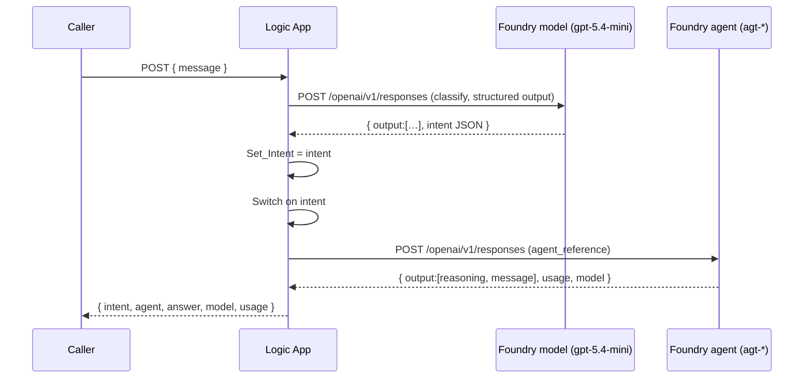

# Developer Reference — Foundry Router (Azure Logic Apps)

Code-level reference for the intent-routing workflow: it classifies an inbound
message with a model, then invokes the matching **Microsoft Foundry agent** and
returns a structured result. For the click-by-click build (menus, screenshots,
analogy), see [Build-Logic-App-Foundry-Router.md](Build-Logic-App-Foundry-Router.md).

- **Plane:** Azure Logic Apps (Consumption), single stateful workflow.
- **Downstream:** Microsoft Foundry Responses API (`/openai/v1/responses`).
- **Auth:** Microsoft Entra managed identity (no keys).

---

## 1. Public HTTP contract

### Request
```
POST  https://<logic-app-trigger-url>
Content-Type: application/json
```
```json
{ "message": "I was double charged on my last invoice" }
```

### Response `200 OK`
```json
{
  "intent": "billing",
  "agent": "agt-billing",
  "answer": "Sorry about that — I can help look into the duplicate charge...",
  "model": "gpt-5.4-mini",
  "usage": { "input_tokens": 4334, "output_tokens": 146, "total_tokens": 4480 }
}
```

### Response fields
| Field | Type | Source |
|---|---|---|
| `intent` | string (`billing` \| `techsupport` \| `other`) | classifier output |
| `agent` | string | which Foundry agent handled it (`""` for fallback) |
| `answer` | string | the agent's final message text |
| `model` | string | model that served the agent call |
| `usage` | object | `input_tokens`, `output_tokens`, `total_tokens` |

### Error responses
| Code | When | Body |
|---|---|---|
| `502` | classifier or an agent call failed / timed out | `{ "answer": "…temporarily unavailable…" }`-style text |
| `NoResponse` (gateway) | a step failed before any Response ran | run aborted — inspect **Run history** |

---

## 2. Data flow



Actions (workflow keys): `When_an_HTTP_request_is_received` → `Classify` →
`Set_Intent` → `Route_by_intent` → (`CallBilling`|`CallTech`) →
(`Reply_billing`|`Reply_tech`|`Reply_fallback`).

---

## 3. Foundry Responses API — the two call types

Both hit the same endpoint; the **body** differs.

```
POST https://<your-account>.services.ai.azure.com/api/projects/<your-account>-project/openai/v1/responses
Authorization: Bearer <managed-identity-token for audience https://ai.azure.com>
Content-Type: application/json
```

### 3.1 Model call — classification (`Classify`)
A plain model call with **structured output** to force clean JSON.
```json
{
  "model": "gpt-5.4-mini",
  "instructions": "You are an intent classifier. Reply with only one of: billing, techsupport, other.",
  "input": "@{triggerBody()?['message']}",
  "text": {
    "format": {
      "type": "json_schema",
      "name": "intent_result",
      "schema": {
        "type": "object",
        "properties": { "intent": { "type": "string", "enum": ["billing", "techsupport", "other"] } },
        "required": ["intent"],
        "additionalProperties": false
      }
    }
  }
}
```
- `instructions` = system prompt (model rules). `input` = raw user message.
- `text.format.json_schema` constrains the **output shape** (not an instruction).

**Response shape (relevant parts):**
```json
{
  "model": "gpt-5.4-mini",
  "output": [
    { "type": "message", "content": [ { "type": "output_text", "text": "{\"intent\":\"billing\"}" } ] }
  ],
  "usage": { "input_tokens": 61, "output_tokens": 13, "total_tokens": 74 }
}
```
- There is **no top-level `output_text`**. The text is at
  `output[last].content[0].text` and here it's the schema-constrained JSON string.

### 3.2 Agent call — invoke a Foundry agent (`CallBilling` / `CallTech`)
No model/instructions here: the agent supplies its own instructions + tools
(Fabric IQ / Foundry IQ) server-side.
```json
{
  "input": "@{triggerBody()?['message']}",
  "agent_reference": { "type": "agent_reference", "name": "agt-billing" }
}
```
- `agent_reference` **requires** `type` (`"agent_reference"`) and `name`.
  (`version` optional; omit to use latest.) The legacy `agent` property is **deprecated**.

**Response shape (relevant parts):**
```json
{
  "model": "gpt-5.4-mini",
  "agent_reference": { "type": "agent_reference", "name": "agt-billing", "version": "6" },
  "output": [
    { "type": "reasoning", "content": [] },
    { "type": "message", "phase": "final_answer",
      "content": [ { "type": "output_text", "text": "Sorry about that — I can help…" } ] }
  ],
  "usage": { "input_tokens": 4334, "output_tokens": 146, "total_tokens": 4480 }
}
```
- Reasoning-capable models emit a **`reasoning`** item first and the **`message`**
  (final answer) last → always read the **last** item.

---

## 4. Response parsing (Workflow Definition Language)

| Purpose | Expression |
|---|---|
| Extract intent (from classifier) | `json(last(body('Classify')?['output'])?['content']?[0]?['text'])?['intent']` |
| Extract agent answer | `last(body('CallBilling')?['output'])?['content']?[0]?['text']` |
| Token usage object | `body('CallBilling')?['usage']` |
| Model name | `body('CallBilling')?['model']` |

Rules:
- Use **`last(output)`** — it returns the message whether or not a reasoning item
  precedes it (classifier: message at `[0]`; agent: message at `[1]`).
- Do **not** use `output_text` (absent) or a fixed `output[0]` (may be reasoning).
- In the **expression editor** use the **bare** expression; in a plain text field
  wrap it as `@{ … }`.

---

## 5. Authentication

- Logic App uses a **system-assigned managed identity** (`ManagedServiceIdentity`)
  on every HTTP action, with `audience = https://ai.azure.com`.
- The identity holds the **Foundry Agent Consumer** role on the Foundry project.
- No API keys or secrets are stored in the workflow.

Action-level auth block:
```json
"authentication": { "type": "ManagedServiceIdentity", "audience": "https://ai.azure.com" }
```

---

## 6. Call it from code

> The trigger URL contains a SAS `sig=`. Keep it in an env var / secret, not in source.

### curl
```bash
curl -X POST "$TRIGGER_URL" \
  -H "Content-Type: application/json" \
  -d '{"message":"I was double charged on my last invoice"}'
```

### PowerShell
```powershell
$body = @{ message = "I was double charged on my last invoice" } | ConvertTo-Json
Invoke-RestMethod -Uri $env:TRIGGER_URL -Method Post -ContentType "application/json" -Body $body
```

### Python
```python
import os, requests

resp = requests.post(
    os.environ["TRIGGER_URL"],
    json={"message": "I was double charged on my last invoice"},
    timeout=120,
)
data = resp.json()   # { intent, agent, answer, model, usage }
print(data["agent"], "->", data["answer"])
```

---

## 7. Error handling (workflow)

Each agent call has a paired error Response via `runAfter`:
```json
"runAfter": { "CallBilling": ["Failed", "TimedOut"] }
```
- `Reply_billing_error` / `Reply_tech_error` → `502` with a friendly message.
- `Reply_classify_error` (top level) → `502` if the classifier fails.
- The `default` Switch branch (`Reply_fallback`) handles an unknown intent.

This guarantees the caller always receives a Response rather than a gateway
`NoResponse`.

---

## 8. Extend: add a new intent + agent

1. Add the new value to the classifier schema `enum` (e.g. `"sales"`).
2. Add a **case** to `Route_by_intent` (`"sales"`).
3. In it, add an HTTP action `CallSales` with
   `agent_reference.name = "agt-sales"`.
4. Add a `Reply_sales` Response returning the structured JSON
   (`intent`/`agent`/`answer`/`model`/`usage`).
5. Add a `Reply_sales_error` with `runAfter: { "CallSales": ["Failed","TimedOut"] }`.

No client change needed — the response contract stays the same.

---

## 9. Full workflow definition

The complete, paste-ready definition is in
[Build-Logic-App-Foundry-Router.md → Appendix A](Build-Logic-App-Foundry-Router.md#appendix-a--full-workflow-paste-into-code-view).

## 10. Related
- Playground clients (terminal, Streamlit, Container App): [`playground/`](playground/)
- Architecture diagram: [`diagrams/how-it-works.png`](diagrams/how-it-works.png)
