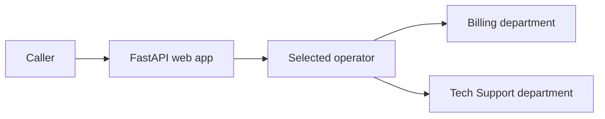

# A2A Foundry Modular Switchboard

This runnable demo proves one idea four ways: a **router agent** chooses whether **Billing** or **Tech Support** answers. The browser stays the same while the routing implementation changes.

The parent [A2A guide](../README.md) explains the basic phone-switchboard analogy. This folder turns that design into code and an Azure deployment.

## What each mode proves

| Mode | Operator | Departments | What it proves |
|---|---|---|---|
| `1` Portal A2A | Foundry prompt agent | Two Foundry prompt agents | Low-code Foundry-to-Foundry A2A |
| `2` Pro-code | Agent Framework agent in Python | Two Foundry prompt agents | Code owns routing while Foundry owns specialists |
| `3a` Hybrid code router | Agent Framework agent in Python | One Foundry agent + one in-code agent | One router can cross implementation boundaries |
| `3b` Hybrid Foundry router | Foundry prompt agent | One Foundry agent + one A2A server on Container Apps | Foundry can call custom code through A2A |



## Verified Azure target

Checked on 2026-08-08 for subscription `<your-subscription>`:

- Region: `southeastasia`
- Model: `gpt-5.4-mini`, `GlobalStandard`
- Model quota: `6000K TPM` limit, `860K TPM` used
- Container Apps managed environments: `50` limit, `6` used
- Resource group: `rg_a2a_foundry` (new)

## Run order

> **Switchboard analogy:** publish departments before saving speed-dials, and save speed-dials before asking the operator to transfer calls.

1. Open this `modular` folder as the VS Code workspace.
2. Create the Python environment:

   ```powershell
   python -m venv .venv
   .\.venv\Scripts\Activate.ps1
   python -m pip install --upgrade pip
   pip install -r backend\requirements.txt
   pip install -r codeagent\requirements.txt
   ```

3. Review `infra/variables.ps1`, then provision Foundry:

   ```powershell
   .\infra\01-provision.ps1
   ```

4. Export the variables and create Scenarios 1, 2, and 3a agents:

   ```powershell
   . .\infra\variables.ps1
   $env:PROJECT_ENDPOINT=$PROJECT_ENDPOINT; $env:MODEL=$MODEL_DEPLOYMENT
   $env:SUBSCRIPTION_ID=$SUBSCRIPTION_ID; $env:RESOURCE_GROUP=$RESOURCE_GROUP
   $env:ACCOUNT=$ACCOUNT; $env:PROJECT=$PROJECT
   .\.venv\Scripts\python.exe .\infra\02-create-foundry-agents.py
   ```

5. Deploy both Container Apps and wire Scenario 3b:

   ```powershell
   .\infra\03-deploy-aca.ps1
   ```

## Local web app

Copy `backend/.env.example` to `backend/.env`, fill in the project values, load them into the shell, then run:

```powershell
.\.venv\Scripts\python.exe -m uvicorn backend.app.main:app --reload
```

Open `http://127.0.0.1:8000`. For Agent Inspector, use **Run and Debug → Debug switchboard with Agent Inspector**.

## Documentation

- [Overview and request journey](docs/00-overview.md)
- [Scenario 1: Portal A2A](docs/01-scenario1-portal-a2a.md)
- [Scenario 2: Agent Framework](docs/02-scenario2-procode-foundry.md)
- [Scenario 3: Hybrid variants](docs/03-scenario3-hybrid.md)
- [Frontend and backend](docs/04-frontend-backend.md)
- [Container Apps deployment](docs/05-deploy-container-apps.md)
- [Deployment alternatives](docs/06-deploy-alternatives.md)