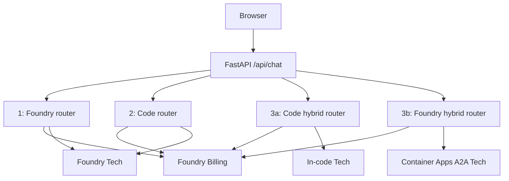

# 00 - Overview: One Switchboard, Four Implementations

## The story

A caller writes, "I was charged twice." The **router agent** acts as the company operator and transfers the request to **Billing**. When the caller writes, "My password expired," the same operator transfers it to **Tech Support**.

The browser never needs to know where an agent runs. It sends one request to FastAPI and receives one consistent response.

## Meet the players

| Technical term | Plain meaning | Switchboard analogy |
|---|---|---|
| Prompt agent | Instructions and tools stored in Foundry | A department employee based at headquarters |
| Router agent | An agent instructed to delegate instead of answer | The switchboard operator |
| Agent card | Machine-readable name, skills, and protocol details | A directory entry |
| A2A endpoint | URL that accepts Agent2Agent messages | A phone extension |
| Project connection | Stored endpoint and authentication settings | A speed-dial |
| Entra token | Short-lived proof of identity | An employee badge |
| Agent Framework | SDK for building agents and orchestration in code | The programmable switchboard |

## Finished architecture



## Request contract

The browser sends:

```json
{"scenario":"3a","message":"My password expired."}
```

The API returns:

```json
{
  "agent": "code-techsupport",
  "reply": "...",
  "trace": [{"step":"router","detail":"..."}]
}
```

The `trace` shown in the UI is an explanatory application trace. Use Foundry **Traces** for authoritative service telemetry.

## Root causes and fixes

| Symptom | Cause | Fix |
|---|---|---|
| Agent card returns `404` | Incoming A2A was not enabled | Run [Scenario 1, Step 3](01-scenario1-portal-a2a.md#step-3---publish-the-two-extensions) |
| A2A call returns `401/403` | Wrong auth type or missing role | Use Entra agent identity and the roles in [Scenario 1](01-scenario1-portal-a2a.md) |
| Router answers directly | Router instructions do not require delegation | Recreate the router with `ROUTER_INSTRUCTIONS` |
| Scenario 3b cannot fetch the card | Public URL or card path is wrong | Verify `/.well-known/agent-card.json` in [Scenario 3](03-scenario3-hybrid.md) |
| API returns `503` | `PROJECT_ENDPOINT` is missing | Load the environment described in [Frontend and backend](04-frontend-backend.md) |

> **Switchboard analogy:** test the real extension, not only the operator's desk. Verify agent cards, specialist calls, and the final browser separately.