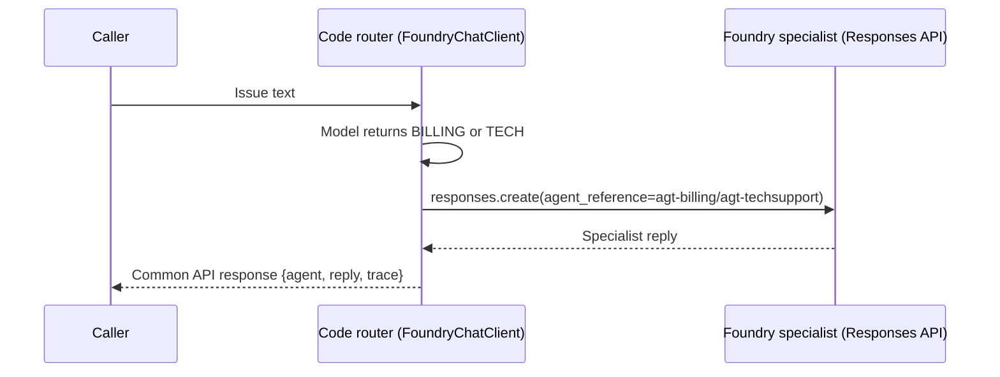

# 02 - Scenario 2: Pro-code on Foundry

Scenario 2 keeps both specialist definitions in Foundry but moves the **operator
into your Python code**. Instead of the Foundry `agt-router`, your code classifies
each request and then calls the matching Foundry specialist.



> 📞 **Switchboard analogy:** you replace the Foundry receptionist with your **own
> operator console**, but the calls still ring the same two departments at
> headquarters.

---

## How it works (3 moves)

1. **Build a code router** — `Agent(client=FoundryChatClient(...))` with
   instructions that force a one-word answer: `BILLING` or `TECH`.
2. **Classify in code** — `await router.run(message)` returns the label; your
   Python `if` picks the specialist name.
3. **Call the Foundry specialist** — `run_managed_agent(name, message)` invokes
   `agt-billing` / `agt-techsupport` through the **Responses API** (the same proven
   path Scenario 1 uses) and returns its reply.

> 🧠 This is **not** keyword matching — the model makes the routing decision. Your
> code only executes the chosen handoff.

---

## ▶️ How to run the demo

### Prerequisites (once)

```powershell
cd a2afoundry\modular
python -m venv .venv
.\.venv\Scripts\Activate.ps1
pip install -r backend\requirements.txt
az login   # your Entra badge; the code calls Foundry with your identity
```

Create `backend\.env` (copy from `backend\.env.example`) with your real values:

```ini
PROJECT_ENDPOINT=https://<your-account>.services.ai.azure.com/api/projects/<your-account>-project
MODEL=gpt-5.4-mini
BILLING_AGENT=agt-billing
TECH_AGENT=agt-techsupport
```

### Option A — CLI runner (fastest)

Runs the two canonical questions and prints the route + reply:

```powershell
.\.venv\Scripts\python.exe -m backend.run_local 2
```

> ⚠️ Run it as a **module** (`-m backend.run_local`) from the `modular` folder —
> `python backend\run_local.py` breaks the package imports.

Expected: the billing question is answered by `agt-billing`, the login question by
`agt-techsupport`, each with a `router` + `handoff` trace line.

### Option B — Web UI (visual)

```powershell
.\.venv\Scripts\python.exe -m uvicorn backend.app.main:app --reload
```

Open **http://127.0.0.1:8000**, click **`02 — Pro-code`**, then send a message (or
a suggestion chip). The **Call trace** panel shows *classified as BILLING/TECH →
code invoked the Foundry agent*.

### Option C — Direct API call

```powershell
Invoke-RestMethod http://127.0.0.1:8000/api/chat -Method Post -ContentType application/json `
  -Body '{"scenario":"2","message":"My password expired"}'
```

The `agent` field should be `agt-techsupport`.

---

## 🧬 Code explanation

The whole scenario is one file:
[`backend/app/scenarios/scenario2_foundry_af.py`](../backend/app/scenarios/scenario2_foundry_af.py).

### 1. The router's instructions

```python
ROUTER_INSTRUCTIONS = """You are a switchboard operator. Classify the request.
Return exactly BILLING for invoices, payments, refunds, or charges.
Return exactly TECH for logins, passwords, lockouts, or error messages.
If uncertain, choose the closest department. Do not add punctuation or explanation."""
```

Forcing a **single-word** answer makes the model's output trivial to branch on.

### 2. Build the code router

```python
router = Agent(
    client=FoundryChatClient(
        project_endpoint=settings.project_endpoint,
        model=settings.model,              # gpt-5.4-mini
        credential=azure_credential(),     # AzureCliCredential locally
    ),
    name="CodeRouter",
    instructions=ROUTER_INSTRUCTIONS,
)
```

`FoundryChatClient` does **direct inference** against your deployed model — this is
the "operator's brain," running in your process (not a Foundry agent resource).

### 3. Classify, then pick the specialist

```python
decision = (await router.run(message)).text.strip().upper()
selected_name = settings.billing_agent if "BILLING" in decision else settings.tech_agent
```

This is **two separate things** — a common point of confusion:

- **The decision is the model's, not hardcoded.** `router.run(message)` sends the
  user text **plus** `ROUTER_INSTRUCTIONS` (the system prompt) to `gpt-5.4-mini`,
  which replies with a single word: `BILLING` or `TECH`. Change the prompt and the
  decision changes. This line does **not** decide anything.
- **The second line is just *wiring*** — it maps the model's label to the *name of
  the agent to call*. Think of it as the switchboard patch panel: "operator said
  'Billing' → connect extension `agt-billing`."

| Expression | Value | Decided by |
|---|---|---|
| `router.run(message)` | `"BILLING"` | 🧠 the LLM (system prompt) |
| `"BILLING" in decision` | `True` | — |
| `settings.billing_agent` | `"agt-billing"` | ⚙️ config (`.env` → `BILLING_AGENT`) |

So *which* branch runs is **model-decided**; the agent **name** is **config**; only
the *shape* ("two departments, one label each") is fixed in code. With more
departments you'd swap the `if/else` for a lookup:

```python
ROUTES = {"BILLING": settings.billing_agent, "TECH": settings.tech_agent}
selected_name = ROUTES.get(decision, settings.tech_agent)  # fallback = TECH
```

> 💡 **Why a tiny vocabulary (`BILLING`/`TECH`) instead of asking the model for the
> agent name directly?** Models are unreliable at emitting exact strings like
> `agt-techsupport` (they might say `Tech Support`). Ask for *intent*, map it to
> *plumbing* in code.

### 4. Call the Foundry specialist

```python
reply = await run_managed_agent(selected_name, message)
```

`run_managed_agent` (in
[`backend/app/foundry.py`](../backend/app/foundry.py)) calls the **Responses API**
with an `agent_reference`, i.e. it invokes the server-managed prompt agent **by
name** — the model and instructions come from the Foundry agent definition:

```python
project.get_openai_client().responses.create(
    input=message,
    extra_body={"agent_reference": {"name": agent_name, "type": "agent_reference"}},
)
```

#### How does a string like `"agt-billing"` become a real agent call?

The name is the **key Foundry uses to find the agent** inside your project. The
chain is:

```text
.env  BILLING_AGENT=agt-billing
   │   (loaded once by config.py)
   ▼
settings.billing_agent  ==  "agt-billing"        # just a string
   │   (passed as selected_name)
   ▼
run_managed_agent("agt-billing", message)
   │   builds an AIProjectClient for PROJECT_ENDPOINT
   ▼
responses.create(agent_reference={"name": "agt-billing", ...})
   │   sent to your Foundry PROJECT
   ▼
Foundry looks up the agent named "agt-billing" in that project,
runs it with ITS model + instructions, and returns the reply.
```

Two things make the link work:

1. **`PROJECT_ENDPOINT`** (from `.env`) tells the SDK *which project* to look in.
2. **`agent_reference.name`** tells Foundry *which agent in that project* to run.

So the "link" is not a function import — it's a **lookup by name inside your
Foundry project**. The name in `.env` must **exactly match** the agent name you
created in the portal (`agt-billing`, `agt-techsupport`). Your identity
(`AzureCliCredential`) must have access to that project, which is why you ran
`az login`.

### 5. Return the shared response shape

```python
return response(selected_name, reply, [
    {"step": "router",  "detail": f"Agent Framework classified the request as {decision}."},
    {"step": "handoff", "detail": f"Code invoked Foundry agent {selected_name}."},
])
```

Every scenario returns the same `{agent, reply, trace}` shape, so the one frontend
works for all of them.

#### What is the `trace` for, and is it required?

**No — the demo works without it.** Those two `trace` steps are **purely for the
UI's "Call trace" panel** — they let a viewer *see* what your code did:

- `router` step → shows the model's decision (`BILLING`/`TECH`).
- `handoff` step → shows which Foundry agent your code then called.

They are **explanatory breadcrumbs your code writes**, not routing logic and not
Foundry telemetry. If you deleted the `trace` list, routing and replies would be
identical — you'd just lose the right-hand panel's step list.

> 🔎 **Not the same as Foundry Traces.** This `trace` is a teaching aid rendered in
> the demo UI. The authoritative, per-call telemetry (spans, tokens, latency) lives
> in the Foundry portal's **Traces** tab. Use the UI trace to *teach*; use Foundry
> Traces to *debug for real*.
>
> Why keep it then? A **consistent** `{agent, reply, trace}` shape across all four
> scenarios lets the **single frontend** render every scenario the same way — so
> switching 1 → 2 → 3a in the UI needs zero frontend changes.

---

## 🛠️ Gotchas fixed while building this

| Symptom | Cause | Fix |
|---|---|---|
| `PROJECT_ENDPOINT is required` even though `.env` exists | A stale shell var (`$env:PROJECT_ENDPOINT=''`) shadowed the file | `config.py` loads `.env` with `override=True` (no-op in Azure) |
| `ModuleNotFoundError: aiohttp` | The async Foundry client needs an async HTTP transport | `aiohttp` is in `backend/requirements.txt` |
| `FoundryAgent(...) got an unexpected keyword 'timeout'` | Not a constructor arg in this SDK build | Removed it |
| `400 Missing required parameter: 'model'` from `FoundryAgent(agent_version=…)` | Versioned prompt-agent path is rough in this SDK build | Call specialists via `run_managed_agent` (Responses API + `agent_reference`) instead |

> ✅ **You're done when:** `python -m backend.run_local 2` sends the billing
> question to `agt-billing` and the login question to `agt-techsupport`.

Next: **[03-scenario3-hybrid.md](03-scenario3-hybrid.md)** for the hybrid routers.