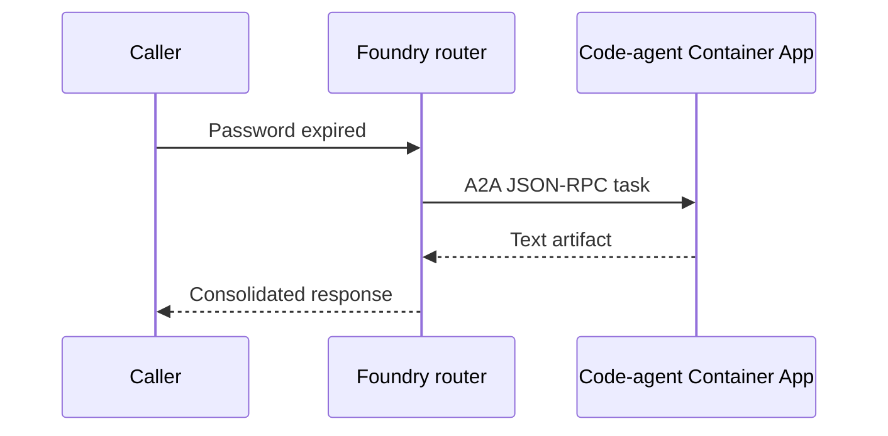

# 03 - Scenario 3: Hybrid Agents

Hybrid means the operator and departments do not all run in the same place.

## Scenario 3a - Code router

The Agent Framework router calls:

- Billing: `agt-billing`, stored in Foundry.
- Tech Support: `CodeTechSupport`, defined inside the FastAPI process.

The code-owned specialist still uses the Foundry model through `FoundryChatClient`; its identity and instructions live in code rather than as a server-managed agent version.

> **Switchboard analogy:** Billing is at headquarters while Tech Support sits beside the operator.

**Verify:** POST one charge request and one login request with `scenario: "3a"`. The response agent changes between `agt-billing` and `code-techsupport`.

## Scenario 3b - Foundry router

The Foundry router calls:

- Billing: Foundry A2A endpoint through `conn-billing`.
- Tech Support: public A2A server on Azure Container Apps through `conn-code-techsupport`.



## Deploy Scenario 3b (real, verified steps)

Scenario 3b needs the code agent to be **publicly reachable**, because the Foundry
router runs in the cloud and cannot reach your `localhost`. So we deploy it to Azure
Container Apps, then wire it into Foundry.

> ⚠️ **Do NOT run the all-in-one `infra/03-deploy-aca.ps1` after a manual portal
> setup.** It recreates the billing/tech/router agents and connections with a
> different auth type and will clobber your working Scenario 1 wiring. Use the
> focused steps below, which **reuse** your existing `conn-billing`.

### Step 1 — Build the code agent image (ACR)

```powershell
. .\infra\variables.ps1
az acr create --name $CONTAINER_REGISTRY --resource-group $RESOURCE_GROUP --sku Basic --admin-enabled true
az acr build --registry $CONTAINER_REGISTRY --image a2a-codeagent:v03 --file codeagent/Dockerfile .
```

> 🐛 **Issue — `az acr build` crashes with `UnicodeEncodeError: 'charmap' codec … cp1252` and exits 1.**
> This is a **Windows log-streaming bug** in the CLI (colorama + pip's Unicode
> output), **not** a build failure. The image is still built and pushed.
> **Fix / workaround:** ignore the exit code and confirm the tag exists:
> ```powershell
> az acr repository show-tags --name $CONTAINER_REGISTRY --repository a2a-codeagent -o tsv
> ```

### Step 2 — Deploy to Container Apps with external ingress

```powershell
az containerapp env create --name $ACA_ENVIRONMENT --resource-group $RESOURCE_GROUP --location $LOCATION
$srv = az acr show --name $CONTAINER_REGISTRY --query loginServer -o tsv
$usr = az acr credential show --name $CONTAINER_REGISTRY --query username -o tsv
$pw  = az acr credential show --name $CONTAINER_REGISTRY --query passwords[0].value -o tsv
az containerapp create --name $CODE_AGENT_APP --resource-group $RESOURCE_GROUP `
  --environment $ACA_ENVIRONMENT --image "$srv/a2a-codeagent:v03" `
  --registry-server $srv --registry-username $usr --registry-password $pw `
  --target-port 8001 --ingress external --min-replicas 1 --max-replicas 2
```

**Ingress must be `external`** — Foundry has to reach it over the public internet.

### Step 3 — Make the card advertise the public URL

The card's `url` tells Foundry where to send A2A calls. It must be the **public
HTTPS FQDN**, not `127.0.0.1`.

```powershell
$fqdn = az containerapp show --name $CODE_AGENT_APP --resource-group $RESOURCE_GROUP --query properties.configuration.ingress.fqdn -o tsv
$url = "https://$fqdn"
az containerapp update --name $CODE_AGENT_APP --resource-group $RESOURCE_GROUP `
  --revision-suffix v03 --set-env-vars "A2A_PUBLIC_URL=$url"
```

> 🐛 **Issue — the card still shows `http://127.0.0.1:8001` after setting the env var.**
> The **original revision** (built without `A2A_PUBLIC_URL`) was still serving.
> **Fix:** force a **new revision** with `--revision-suffix` so the running
> container *starts* with the variable. Verify:
> ```powershell
> (Invoke-RestMethod "$url/.well-known/agent-card.json").url   # must be the https FQDN
> ```

### Step 4 — Wire the connection + hybrid router

```powershell
.\.venv\Scripts\python.exe infra\03b-wire-hybrid.py $url
```

This creates the `conn-code-techsupport` connection (auth `None`) and the
`agt-hybrid-router` with two A2A tools — reusing your existing `conn-billing`.

> ✅ **`authType: None` works** for an anonymous A2A endpoint (our code agent needs
> no auth). Foundry accepts it (HTTP 200).

### Step 5 — Test

```powershell
.\.venv\Scripts\python.exe -m backend.run_local 3b
```

Billing → `agt-billing`; login → the reply begins **"Code Tech Support answered
through A2A"**, proving the Foundry router reached your Container App.

> 📞 **Switchboard analogy:** the operator saves a public extension for a remote
> department and dials it over the outside line.

---

## 🔑 The big one: A2A protocol version (v0.3 vs v1.0)

This blocks most people, so it gets its own section.

**Symptom** (from the Foundry router):

```text
Failed to resolve agent card: Failed to parse JSON: JSON deserialization for
type 'A2A.V0_3.AgentCard' was missing required properties including:
'url', 'protocolVersion', 'preferredTransport'.
```

**Cause:** Foundry's A2A tool, when calling a **custom** (non-Foundry) endpoint,
expects an **A2A v0.3** agent card — but `a2a-sdk 1.1.0` serves the newer **v1.0**
shape. Foundry fetched the card and refused to parse it.

| Contract detail | v1.0 (`a2a-sdk 1.1.0`) | v0.3 (what Foundry wants) |
|---|---|---|
| Endpoint location | `supportedInterfaces[].url` | top-level `url` |
| Version field | `supportedInterfaces[].protocolVersion` | top-level `protocolVersion` |
| Transport | `supportedInterfaces[].protocolBinding` | top-level `preferredTransport` |
| JSON-RPC method | `SendMessage` | `message/send` |

**Fix:** since the code agent is trivial, we **hand-serve exactly the v0.3
contract** with plain Starlette (no `a2a-sdk`) — full control over the wire format.
See [`codeagent/server.py`](../codeagent/server.py):

- `GET /.well-known/agent-card.json` → a v0.3 card (`protocolVersion: "0.3.0"`, top-level `url`, `preferredTransport: "JSONRPC"`).
- `POST /` → handles JSON-RPC `message/send`, returns a v0.3 `message` result.

> 💡 **Takeaway:** when exposing *your own code* to a Foundry A2A router, match the
> **v0.3** card + `message/send`. A hand-rolled endpoint is often simpler and more
> predictable than pinning SDK protocol versions.

---

## 🔬 Anatomy of the code agent (`server.py` + `Dockerfile`)

New to A2A? A common surprise: [`codeagent/server.py`](../codeagent/server.py) has
**no "A2A" import** — just `starlette`. That's expected.

> 🧠 **"A2A agent" is a *protocol*, not a library.** An A2A agent is simply an HTTP
> server that (1) publishes an **agent card** and (2) answers **`message/send`**
> over JSON-RPC. Any framework can do it. **Starlette is only the web plumbing**
> (FastAPI is built on it); it does not "create an agent."

So the agent is defined by **two shapes**, not by a class:

| Part | Route | Role | Switchboard analogy |
|---|---|---|---|
| **Agent card** | `GET /.well-known/agent-card.json` | "Who am I, what can I do, where do you call me" | The department's **directory entry** |
| **Message handler** | `POST /` (`message/send`) | "Do the work and reply" | Actually **answering the phone** |
| Health | `GET /health` | Liveness check | The line is up |

### `server.py`, part by part

```python
PUBLIC_URL = os.getenv("A2A_PUBLIC_URL", "http://127.0.0.1:8001").rstrip("/")
```
The public HTTPS address Foundry uses. Set by the Container App (Step 3); the card
must advertise this, not `127.0.0.1`.

```python
def agent_card(_request):
    return JSONResponse({
        "protocolVersion": "0.3.0",          # the version Foundry expects
        "name": "Code Tech Support",
        "url": PUBLIC_URL,                    # where to POST message/send
        "preferredTransport": "JSONRPC",
        "skills": [{ "id": "login-help", ... }],
        ...
    })
```
This is the **whole reason the agent is discoverable** — it's the v0.3 card Foundry
fetches and parses. (See [the v0.3 vs v1.0 section](#-the-big-one-a2a-protocol-version-v03-vs-v10).)

```python
async def jsonrpc(request):
    body = await request.json()
    if body.get("method") not in ("message/send", "message/stream"):
        return JSONResponse({... "error": {"code": -32601, "message": "Method not found"}})
    user_text = _text_from_message(body["params"]["message"])
    reply = "Code Tech Support answered through A2A: ..."   # <- the only "brain"
    return JSONResponse({"jsonrpc": "2.0", "id": body.get("id"),
                         "result": {"role": "agent", "parts": [{"kind": "text", "text": reply}], ...}})
```
This is the **agent's actual behavior**. Here it's a canned string — in a real
agent you'd call an LLM or a Foundry agent here and return *that* text. The A2A
contract (request/response shape) stays the same either way.

```python
app = Starlette(routes=[
    Route("/.well-known/agent-card.json", agent_card, methods=["GET"]),
    Route("/", jsonrpc, methods=["POST"]),
    Route("/health", health, methods=["GET"]),
])
```
Starlette just maps URLs to those functions. That's all the "framework" does.

### `Dockerfile`, line by line

```dockerfile
FROM python:3.12-slim                 # small Python base image
ENV PYTHONDONTWRITEBYTECODE=1 \       # no .pyc files (smaller, cleaner)
    PYTHONUNBUFFERED=1                 # logs stream immediately (good for ACA logs)
WORKDIR /app                          # everything runs from /app
COPY codeagent/requirements.txt ./requirements.txt
RUN pip install --no-cache-dir -r requirements.txt   # only starlette + uvicorn
COPY codeagent/server.py ./server.py  # the agent
EXPOSE 8001                           # documents the port (ACA --target-port 8001)
CMD ["uvicorn", "server:app", "--host", "0.0.0.0", "--port", "8001"]
```

Key points:
- **`requirements.txt` is tiny** (`starlette`, `uvicorn`) — no `a2a-sdk`, because we
  hand-serve the protocol. Fewer deps = faster builds, no SDK version surprises.
- **`--host 0.0.0.0`** is required so the server accepts connections from outside the
  container (not just localhost) — Container Apps' ingress forwards to it.
- **Build context is the `modular` folder**, which is why paths are `codeagent/...`
  (`az acr build --file codeagent/Dockerfile .`).

> 💡 **Takeaway:** to expose *any* code as a Foundry-callable agent, you only need a
> web server that serves a v0.3 card and answers `message/send`. Swap the canned
> reply for real logic and you have a production agent — same 3 routes.

---

## Full issue → fix table (Scenario 3b)

| Symptom | Cause | Fix |
|---|---|---|
| `az acr build` exits 1 with `cp1252` `UnicodeEncodeError` | Windows CLI log-streaming bug (colorama) | Build actually succeeded — verify with `az acr repository show-tags` |
| Card shows `http://127.0.0.1:8001` | Old revision (no `A2A_PUBLIC_URL`) still active | Force a new revision: `--revision-suffix … --set-env-vars A2A_PUBLIC_URL=…` |
| `Failed to resolve agent card … A2A.V0_3.AgentCard missing url/protocolVersion/preferredTransport` | Code agent served a v1.0 card; Foundry wants v0.3 | Serve a v0.3 card + `message/send` (hand-rolled Starlette) |
| Card reachable locally but not from Foundry | Ingress is internal | Deploy with `--ingress external` |
| Router `403` calling Billing | Project managed identity lacks the role | Grant **Foundry Agent Consumer** to the project MI (see [Scenario 1, Step B3](../../02-setup-step-by-step.md)) |
| Router won't call the code agent | Hybrid router missing the code connection/tool | Rerun `infra/03b-wire-hybrid.py` after the public URL exists |

## Validate

Use the router's Foundry **Chat** first, then **Traces**, then the web app with
scenario `3b`. A correct trace shows an A2A tool call to `conn-code-techsupport`,
and the reply begins **"Code Tech Support answered through A2A"**.